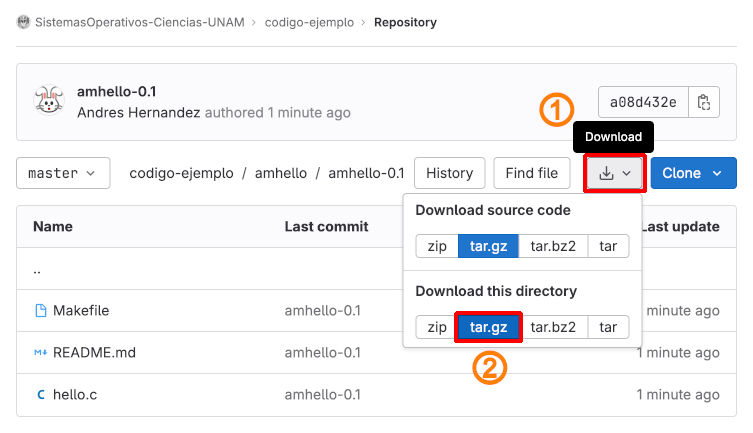

<!--	= ^ . ^ =	-->

### Historia de C y UNIX

- UNIX
- K&R C
- ANSI C

--------------------------------------------------------------------------------

### Tipos de lenguajes de programación

- Paradigma procedural
- Lenguaje de alto nivel

--------------------------------------------------------------------------------

# Compilador de C

--------------------------------------------------------------------------------

### Instalación del compilador de C

Debian, Ubuntu, Mint, ...

```bash
root@debian:~# apt install build-essential automake
	...
```

Red Hat, CentOS, Rocky, Alma, Oracle, ...

```bash
[root@rocky ~]# dnf groupinstall 'Development Tools'
	...
```

--------------------------------------------------------------------------------

### Verificar la instalación del compilador

```bash
root@linux:~# which cc make autoconf automake
/usr/bin/cc
/usr/bin/make
/usr/bin/autoconf
/usr/bin/automake
```

```bash
root@linux:~# whereis cc make autoconf automake
cc: /usr/bin/cc
make: /usr/bin/make /usr/share/man/man1/make.1.gz
autoconf: /usr/bin/autoconf /usr/share/autoconf /usr/share/man/man1/autoconf.1.gz
automake: /usr/bin/automake /usr/share/man/man1/automake.1.gz
```

--------------------------------------------------------------------------------

### Prueba del compilador de C

[Descargar código fuente `amhello-0.1`][amhello-0.1]

[][amhello-0.1]

[amhello-0.1]: https://gitlab.com/SistemasOperativos-Ciencias-UNAM/codigo-ejemplo/-/tree/master/amhello/amhello-0.1?ref_type=heads

--------------------------------------------------------------------------------

### Prueba del compilador de C

Extraer código fuente

```bash
$ tar -xvf amhello-0.1.tar.gz
	...
```

Cambiar al directorio `amhello-0.1`

```bash
$ cd amhello-0.1
```

--------------------------------------------------------------------------------

### Prueba del compilador de C

Ejecutar `make`

```bash
$ make
########	hello	########
gcc -g -O2 -o hello hello.c
file hello
hello: ELF 64-bit LSB pie executable, ARM aarch64, version 1 (SYSV), dynamically linked, interpreter /lib/ld-linux-aarch64.so.1, BuildID[sha1]=ab18e89297796f8c0e47e5cff913d94106070243, for GNU/Linux 3.7.0, with debug_info, not stripped
```

--------------------------------------------------------------------------------

### Ejecutar el binario

```bash
$ ./hello
Hello world
```

--------------------------------------------------------------------------------

# Código en lenguaje `C`

--------------------------------------------------------------------------------

### Sintaxis de un programa

- palabras reservadas
- Identificadores
- Funciones
- Directivas del preprocesador
- Prototipos

--------------------------------------------------------------------------------

```
#include <stdio.h>
int main(void)
{
  printf("%s", "Hello world!");
  return 0;
}
```

--------------------------------------------------------------------------------

### Prototipos de función

- `int main(void)`
- `int main(int argc, char* argv[])`
- `int main(int argc, char* argv[], char* envp[])`

--------------------------------------------------------------------------------

### Compilación a de un programa

- Compilación manual con cc y opciones
- Compilación con Makefile

--------------------------------------------------------------------------------

### Directivas del pre-procesador

- include
- define
- ifdef
- ifndef

--------------------------------------------------------------------------------

### Bibliotecas de C

- Archivos de cabecera y de implementación
- Código objeto o, archivos a, bibliotecas de ligado dinámico so
- Ligado y programa ejecutable
- Bibliotecas estándar
- Bibliotecas portables
- Bibliotecas de terceros: curl, libssl

--------------------------------------------------------------------------------

### Tipos de datos básicos

- int, float, char, void, NULL

--------------------------------------------------------------------------------

### Modificadores

- short
- long
- long long

--------------------------------------------------------------------------------

### Modificadores de signo

- signed
- unsigned

--------------------------------------------------------------------------------

### Representaciones de enteros

- decimal
- hex: `0xhh` `\xhh` Se permite cualquier numero de dígitos hexadecimales
- oct: `0ooo` `\ooo` Se permiten hasta tres dígitos o tales

<!-- Tabla de tipos de datos con valores máximos y mínimos -->

--------------------------------------------------------------------------------

### Operadores

- Aritméticos
- Comparación
- Manejo de bits
- Booleanos
- Manejo de cadenas
- Tipos de entrada y salida

--------------------------------------------------------------------------------

| Grupo de precedencia                          | Operadores         | Asociatividad
|:----------------------------------------------|:-------------------|:-------------:|
| Función, arreglo, miembro de estructura, puntero a miembro de estructura | `()` `[]` `.` `->`   | I ⇒ D
| Operadores unarios                            | `-` `++` `--` `!` `~` `*` `&` `sizeof` `(tipo)` | D ⇒ I

--------------------------------------------------------------------------------

| Grupo de precedencia                          | Operadores         | Asociatividad
|:----------------------------------------------|:-------------------|:-------------:|
| Multiplicación, división y resto aritméticos  | `*` `/` `%`        | I ⇒ D
| Suma y resta aritméticas                      | `+` `-`            | I ⇒ D
| Operadores de desplazamiento a nivel de bits  | `<<` `>>`          | I ⇒ D

--------------------------------------------------------------------------------

| Grupo de precedencia                          | Operadores         | Asociatividad
|:----------------------------------------------|:-------------------|:-------------:|
| Operadores relacionales                       | `<` `<=` `>` `>=`  | I ⇒ D
| Operadores de igualdad                        | `==` `!=`          | I ⇒ D
| `AND` a nivel de bits                         | `&`                | I ⇒ D

--------------------------------------------------------------------------------

| Grupo de precedencia                          | Operadores         | Asociatividad
|:----------------------------------------------|:-------------------|:-------------:|
| `XOR` a nivel de bits                         | `^`                | I ⇒ D
| `OR` a nivel de bits                          | `|`                | I ⇒ D
| `AND` lógica                                  | `&&`               | I ⇒ D

--------------------------------------------------------------------------------

| Grupo de precedencia                          | Operadores         | Asociatividad
|:----------------------------------------------|:-------------------|:-------------:|
| `OR` lógica                                   | `||`               | I ⇒ D
| Operador condicional                          | `?	:`             | D ⇒ I

--------------------------------------------------------------------------------

| Grupo de precedencia                          | Operadores         | Asociatividad
|:----------------------------------------------|:-------------------|:-------------:|
| Operadores de asignación                      | `=` `+=` `-=` `*=` `/=` `%=` `&=` `^=` `|=` `<<=` `>>=` | D ⇒ I
| Operador coma                                 | `,`                | I ⇒ D

<!--
U+219x 	← 	↑ 	→ 	↓
U+21Dx 	⇐ 	⇑ 	⇒ 	⇓
U+21Ex 	⇠ 	⇡ 	⇢ 	⇣

⬅️ ⬆️ ➡️ ⬇️
-->

--------------------------------------------------------------------------------

### Enmascaramiento de tipos de datos

- cast
- void

--------------------------------------------------------------------------------

#### Tipos de datos y reglas de conversión de datos

--------------------------------------------------------------------------------

| Tipo de dato    | Descripción                          | Detalles                      | Requisitos típicos de memoria
|:---------------:|:-------------------------------------|:------------------------------|:-----------------------------:|
| `int`           | Número entero                        | Estándar                      | 2 bytes <br/> (1 _word_)
| `short`         | Número entero "corto"                | Menos dígitos que `int`       | 2 bytes <br/> (1 _word_)
| `long`          | Número entero "largo"                | Más dígitos que `int`         | 4 a 8 bytes <br/> (1 a 2 _words_)
| `unsigned` †    | Número sin signo <br/> (no negativo) | Doble valor máximo de `int`   | 2 bytes <br/> (1 _word_)

--------------------------------------------------------------------------------

† La palabra `unsigned` puede aparecer como modificador a `short`:

- `unsigned short int`
- `unsigned short`

y también como modificador a `long`:

- `unsigned long  int`
- `unsigned long`

--------------------------------------------------------------------------------

| Tipo de dato    | Descripción | Detalles          | Requisitos típicos de memoria
|:---------------:|:------------|:------------------|:-----------------------------:|
| `char`          | Caracter    | Estándar          | 1 byte
| `signed char`   | Caracter    | Rango -128 a +127 | 1 byte
| `unsigned char` | Caracter    | Rango 0 a 255     | 1 byte

--------------------------------------------------------------------------------

| Tipo de dato    | Descripción                                     | Detalles                                   | Requisitos típicos de memoria
|:---------------:|:------------------------------------------------|:-------------------------------------------|:-----------------------------:|
| `float`         | Número de punto flotante                        | Contiene punto decimal y exponente         | 2 bytes <br/> (1 _word_)
| `double`        | Número de punto flotante de doble precisión     | Más cifras significativas, exponente mayor | 8 bytes <br/> (2 _words_)
| `long double`   | Número de punto flotante de precisión extendida | Mayor rango de valores que `double`        | 2 o más bytes <br/> (1 o más _words_)

--------------------------------------------------------------------------------

| Tipo de dato    | Descripción                          | Detalles                      | Requisitos típicos de memoria
|:---------------:|:-------------------------------------|:------------------------------|:-----------------------------:|
| `void`          | Tipo de dato para funciones que no devuelven ningún valor |   | _No aplica_
| `enum`          | Constante de enumeración        | Tipo especial `int`         | 2 bytes <br/> (1 _word_)

--------------------------------------------------------------------------------

### Reglas de conversión

--------------------------------------------------------------------------------

Estas reglas aplican a operaciones aritméticas entre dos operadores con distintos tipos de datos.
Puede existir alguna variación de una versión de C a otra.

| Operando | Operando convertido | Resultado
|:--------:|:-------------------:|:---------:|
| `long double` | `long double` | `long double`
| `double` | `double` | `double`
| `float` | `float` | `float`
| `unsigned long int` | `unsigned long int` | `unsigned long int`

--------------------------------------------------------------------------------

| Operando 1 | Operando 2 | Notas
|:--------:|:-------------------:|:---------:|
| `long int` | `unsigned int` | _Ver notas_

a. Si `unsigned int` se puede convertir a `long int`, entonces el resultado es `long int`.
b. Si no se puede convertir, ambos serán convertidos a `unsigned long int` y el resultado será `unsigned long int`

--------------------------------------------------------------------------------

| Operando | Operando convertido | Resultado
|:--------:|:-------------------:|:---------:|
| `long int` | `long int` | `long int`
| `unsigned int` | `unsigned int` | `unsigned int`

--------------------------------------------------------------------------------

Si no se puede aplicar ninguna de las conversiones anteriores, entonces ambos operandos serán convertidos a `int` (si es necesario) y el resultado será de tipo `int`.

Nota: Algunas versiones de C convierten _automáticamente_ todos los operandos `float` a `double` antes de hacer operaciones

--------------------------------------------------------------------------------

### Reglas de asignación

Si los dos operandos en una expresión de asignación son de tipos distintos, entonces el valor del operando de la derecha será automáticamente convertido al tipo del operando de la izquierda.

--------------------------------------------------------------------------------

La expresión de asignación completa será de este mismo tipo.
Además:

1. Un valor en coma flotante puede truncarse si se asigna a un identificador entero.
2. Un valor en doble precisión puede ser redondeado si se asigna a un identificador en coma flotante (simple precisión).
3. Una cantidad entera puede ser alterada si se asigna a un identificador de entero más corto o a un identificador de carácter (algunos de los bits más significativos pueden perderse).

--------------------------------------------------------------------------------

### Variables

- declaración
- globales
- locales
- Internas
- scope (alcance)
- constantes (const)
- Constantes simbólicas (define)

--------------------------------------------------------------------------------

### Instrucciones de control

- return
- goto

--------------------------------------------------------------------------------

### Condicionales

- if
- if-else
- Condicional triple a?b:c
- switch-case
- Anidados
- Múltiples (álgebra booleana)

--------------------------------------------------------------------------------

### Ciclos

- while
- do-while
- for
- break
- continue
- next?

--------------------------------------------------------------------------------

### Instrucciones de control

--------------------------------------------------------------------------------

:::::::::::::: {.columns}
::: {.column width="25%"}

**Instrucción**

`break`

:::
::: {.column width="75%"}

**Ejemplo**

```
for (n=1;n<=100;n++)
{
  scanf("%f", &x);
  if (x<0)
  {
    printf("ERROR - Negativo");
    break;
  }
}
```

:::
::::::::::::::

--------------------------------------------------------------------------------

::: {.columns}
:::: {.column}
**Instrucción**

`continue`
::::
:::: {.column}
**Ejemplo**

```
for (n=1;n<=100;n++)
{
  scanf("%f", &x);
  if (x<0)
  {
    printf("ADVERTENCIA - Negativo");
    continue;
  }
}
```
::::
:::

--------------------------------------------------------------------------------

::: {.columns}
:::: {.column}
**Instrucción**

`do-while`
::::
:::: {.column}
**Ejemplo**

```
do
{
  printf("%d\n", digito++);
}
while (digito <= 9)
```
::::
:::

--------------------------------------------------------------------------------

::: {.columns}
:::: {.column}
**Instrucción**

`while`
::::
:::: {.column}
**Ejemplo**

```
while (digito <= 9)
{
  printf("%d\n", digito++);
}
```
::::
:::

--------------------------------------------------------------------------------

::: {.columns}
:::: {.column}
**Instrucción**

`for`
::::
:::: {.column}
**Ejemplo**

```
for (digito=0; digito<=9; digito++)
{
  printf("%d\n", digito);
}
```
::::
:::

--------------------------------------------------------------------------------

::: {.columns}
:::: {.column}
**Instrucción**

`goto`
::::
:::: {.column}
**Ejemplo**

```
if (x<0)
  goto etiqueta;
...	...	...
etiqueta:	printf("ERROR");
```
::::
:::

--------------------------------------------------------------------------------

::: {.columns}
:::: {.column}
**Instrucción**

`if`
::::
:::: {.column}
**Ejemplo**

```
if (x<0)
  printf("Negativo");
```
::::
:::

--------------------------------------------------------------------------------

::: {.columns}
:::: {.column}
**Instrucción**

`if-else`
::::
:::: {.column}
**Ejemplo**

```
if (x<0)
  printf("Negativo");
else
  printf("Positivo");
```
::::
:::

--------------------------------------------------------------------------------

::: {.columns}
:::: {.column}
**Instrucción**

`if-anidado`
::::
:::: {.column}
**Ejemplo**

```
if (x<0)
  printf("Negativo");
else
  if (x>0)
    printf("Positivo");
  else
    printf("Cero");
```
::::
:::

--------------------------------------------------------------------------------

::: {.columns}
:::: {.column}
**Instrucción**

`return`
::::
:::: {.column}
**Ejemplo**

```
int suma(int a, int b)
{
  return (a + b);
}
```
::::
:::

--------------------------------------------------------------------------------

::: {.columns}
:::: {.column}
**Instrucción**

`switch`
::::
:::: {.column}
**Ejemplo**

```
eleccion = getchar()
switch (eleccion) {
  case 'R':
    printf("Rojo");
    break;
  case 'G':
    printf("Verde");
    break;
  case 'B':
    printf("Azul");
    break;
  default:
    printf("ERROR");
}
```
::::
:::

--------------------------------------------------------------------------------

### Arreglos

- Tamaño fijo
- Tamaño dinámico
- Unidimensional
- Multidimensional

--------------------------------------------------------------------------------

### Apuntadores

- Concepto de apuntador
- Operaciones con apuntadores

--------------------------------------------------------------------------------

### Manejo de cadenas

- Arreglo de caracteres: `*char` , `char[]`
- `\0`, `NULL`, `EOF`
- Multi-línea o multi-cadena: `*char[]` , `**char`
- Copia: `strcpy()`, `strncpy()`
- Comparación de cadenas
- Operaciones con cadenas: append, split, substring
- Operaciones avanzadas: strtok

--------------------------------------------------------------------------------

### Conversión de tipos de datos

- cast, void
- Cadena a número: atoi, atol, atos, atof, atod
- Numero a cadena: itoa, loa, stoa, ftoa, dtoa

--------------------------------------------------------------------------------

### Entradas y salidas de un programa

- stdin
- stdout
- stderr
- argv
- envp
- files
- signal
- return code $?

--------------------------------------------------------------------------------

### Declaración de funciones

- función main (entrypoint)
- prototipo de función
- Declarar sin prototipo antes de main
- Declarar prototipo e implementar después de main
- Declarar prototipo e implementación en un archivo de cabecera
- Declarar prototipo en un archivo de cabecera e implementar en un archivo de código

--------------------------------------------------------------------------------

### Entrada y salida

- Archivos abiertos de un programa: stdin, stdout, stderr
- Caracteres de control y conversión de printf
- Especificador de formato (printf y scanf)
- Salida estándar: putc, putchar, puts, printf
- Error estándar es otro archivo abierto
- Entrada estándar: getc, getchar, gets, scanf

--------------------------------------------------------------------------------

### Entrada y salida

- Descriptor de archivo
- Apuntador a archivo
- EOF
- Operaciones con archivos: open, fopen, clase, fclose, read, write, seek
- Modos de archivo: texto, binario, append, truncate
- Salida a archivo: fputc, fputchar, fputs, fprintf
- Entrada desde archivos: fgetc, fgetchar, fgets, fscanf

--------------------------------------------------------------------------------

### Caracteres de conversión de `scanf`

--------------------------------------------------------------------------------

| Caracter | Descripción
|:--------:|:-----------
| `c` | Caracter (`char`)
| `d` | Entero decimal (`int`)
| `e` | Decimal de punto flotante (`float`)
| `f` | Decimal de punto flotante (`float`) <!-- ? -->
| `g` | Decimal de punto flotante (`float`) <!-- ? -->
| `h` | Entero "corto" (`short int`)
| `i` | Entero decimal, hexadecimal u octal
| `o` | Entero octal

--------------------------------------------------------------------------------

| Caracter | Descripción
|:--------:|:-----------
| `s` | Cadena de caracteres seguido de un espacio en blanco †
| `u` | Entero decimal sin signo (`unsigned int`)
| `x` | Entero hexadecimal
| `[. . .]` | Cadena de caracteres que puede contener espacios en blanco

† El terminador de cadena `\0` se añade automáticamente

--------------------------------------------------------------------------------

Un prefijo puede anteceder a ciertos caracteres de conversión

| Prefijo | Descripción
|:-------:|:-----------
| `h` | Entero "corto" con o sin signo (`short int` o `unsigned short`)
| `l` | Número "largo" (`long`, `unsigned long`, `double`)
| `L` | Número "largo" (`long double`)

--------------------------------------------------------------------------------

### Caracteres de conversión de `printf`

‡ Algunos de estos caracteres se interpretan de modo diferente que en `scanf`

--------------------------------------------------------------------------------

| Caracter | Descripción
|:--------:|:-----------
| `c` | El dato se imprime como caracter (`char`)
| `d` | El dato se imprime como entero (`int`)
| `e` | El dato see imprime como valor flotante CON exponente (`float`) (notación científica)
| `f` | El dato see imprime como valor flotante SIN exponente (`float`)

--------------------------------------------------------------------------------

| Caracter | Descripción
|:--------:|:-----------
| `g` | El dato see imprime de acuerdo a la conversión †

† El dato se muestra como un valor en coma flotante usando la conversión de tipo e o f, dependiendo del valor;
no se muestran ceros no significativos ni el punto decimal si no es significativo

--------------------------------------------------------------------------------

| Caracter | Descripción
|:--------:|:-----------
| `i` | El dato see imprime como entero **con signo** (`int`)
| `o` | El dato see imprime como octal <u>sin el cero inicial</u>
| `s` | El dato see imprime como cadena de caracteres
| `u` | El dato see imprime como entero **sin signo** (`unsigned int`)
| `x` | El dato see imprime como hexadecimal <u>sin el prefijo</u> `0x`

--------------------------------------------------------------------------------

Un prefijo puede anteceder a ciertos caracteres de conversión

| Prefijo | Descripción
|:-------:|:-----------
| `h` | Entero "corto" con o sin signo (`short int` o `unsigned short`)
| `l` | Número "largo" (`long`, `unsigned long`, `double`)
| `L` | Número "largo" (`long double`)

--------------------------------------------------------------------------------

La función `printf` acepta algunos modificadores

| Modificador | Descripción
|:-----------:|:-----------
| `-` | El dato es justificado a la izquierda dentro del campo <br/> Los espacios se agregan **al final**.
| `+` | El prefijo de signo `+` o `-` se agregará a cada número <br/> Sin este modificador únicamente los números negativos tendrán el signo.

--------------------------------------------------------------------------------

| Modificador | Descripción
|:-----------:|:-----------
| `0` | Añade ceros en lugar de espacios en blanco <br/> Aplica a datos justificados a la derecha y en campos cuya longitud es mayor que el dato †
† Nota: algunos compiladores consideran el indicador cero como una parte de la especificación de la longitud de campo en vez de como un indicador
real.
Esto segura que el O se procese el último si están presentes múltiples indicadores.

--------------------------------------------------------------------------------

| Modificador | Descripción
|:-----------:|:-----------
| ` ` <br> _Espacio en blanco_ | Un _espacio en blanco_ precede a los datos **positivos** <br/> Este indicade es anulado por `+` si ambos están presentes

--------------------------------------------------------------------------------

| Modificador | Descripción
|:-----------:|:-----------
| `#` | Con conversiones `o-` y `x-` <br/> Hace que los datos octales sean precedidos por `0` y los hexadecimales sean precedidos por `0x`
| `#` | Con cnoversiones `e-`, `f-` y `g-` <br/> Hace que esté presente el punto decimal en todos los números de punto flotante, incluso si el número no tiene decimales. <br/> Trunca los ceros no significativos con la conversión `g-`.

--------------------------------------------------------------------------------

### Tipos de datos complejos y compuestos

- Enum
- Estructuras: typedef, struct
- Union

--------------------------------------------------------------------------------

### Manejo de memoria

- malloc, calloc
- free
- sizeof
