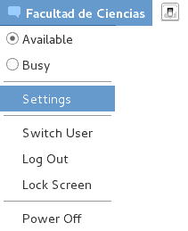
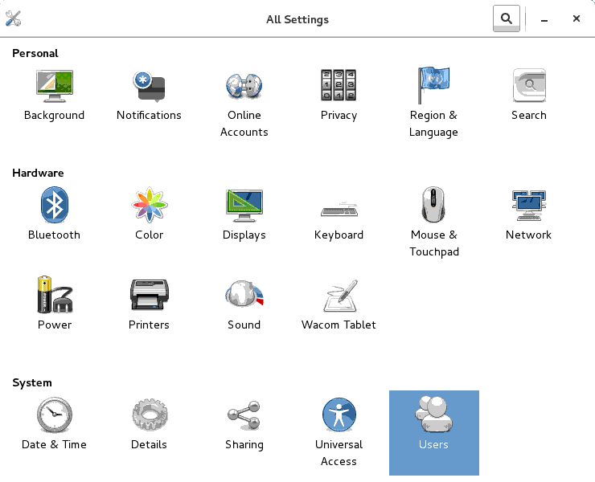
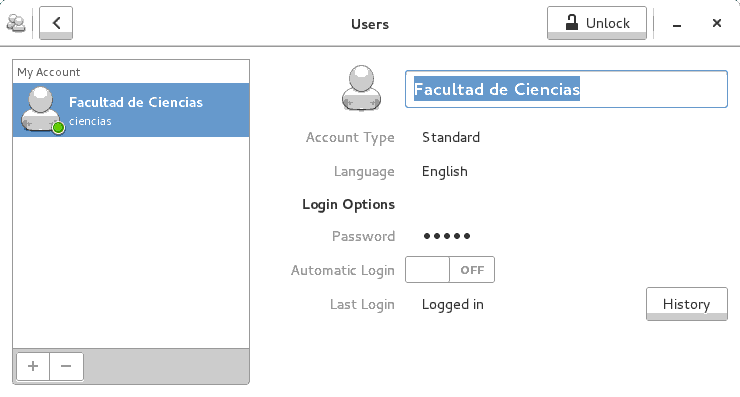
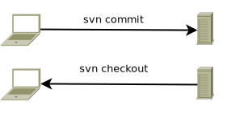

# Control de versiones con git
<div style="margin: 0.3em auto; text-align: center;">
  <div style="font-size: 1.5em;">Andrés Hernández</div>
  <span>
    
  </span>
  <div style="font-size: 1.1em;">Universidad Nacional Autónoma de México</div>
  <div style="font-size: 1.1em;">Facultad de Ciencias</div>
  <div style="font-size: 0.9em;">Junio 2016</div>
</div>

<span>
  <a id="book" alt="html5 book version" href="book.html">
    
  </a>
</span>
<br/>
<span>
  <a id="UNAM" href="http://www.unam.mx/">
    
  </a>
</span>
<span>
  <a id="Ciencias" href="http://www.fciencias.unam.mx/">
    
  </a>
</span>
<div style="clear: both;" />

--------------------------------------------------------------------------------

# Información del curso

## Nivel de especialización

Básico

## Objetivo

El alumno conocerá el sistema de control de versiones git y aprenderá el uso de esta herramienta tanto desde línea de comandos, como desde un cliente de escritorio y vía web a través de Github.

--------------------------------------------------------------------------------

# Perfil del asistente

Estudiantes, pasantes o egresados de carreras afines a computación, desarrolladores y entusiastas de la programación.

## Conocimientos previos

+ Conocimientos básicos de GNU/Linux y Windows a nivel usuario
+ Uso de internet
+ Cuenta de correo electrónico
+ Conocimientos básicos de inglés a nivel técnico

--------------------------------------------------------------------------------

# Temario

1. Introducción a los sistemas de control de versiones
   1. Local
   2. Centralizado
   3. Distribuido

2. Introducción a git
   1. Inicializar un repositorio
   2. Clonar un repositorio existente
   3. Agregar archivos
   4. Guardar cambios en el repositorio
   5. Borrar archivos
   6. Mover archivos
   7. Enviar cambios al servidor
   8. Revisar el estado de los archivos en el directorio de trabajo
   9. Bitácora de revisiones del proyecto

--------------------------------------------------------------------------------

# Temario (cont)

3. Configuración del cliente git
   1. Datos del usuario
   2. Reparar fin de línea en los archivos
   3. Ignorar espacios en blanco

4. Trabajando con repositorios existentes
   1. Clonar un repositorio existente
   2. Resolución de conflictos
   3. Corregir el commit anterior

--------------------------------------------------------------------------------

# Temario (cont 2)

5. Introducción a Github
   1. Crear una cuenta en Github
   2. Administración de repositorios via web
   3. Cliente gráfico de git para Mac y Windows
   4. Documentación en Markdown

6. Trabajo colaborativo en Github
   1. Fork
   2. Pull requests
   3. gist
   4. Github Pages
   5. Wikis

--------------------------------------------------------------------------------

# 0. Configurar el nombre de usuario

+ Abrir el cuadro de diálogo de **preferencias del sistema**

<span>
  
</span>

--------------------------------------------------------------------------------

+ Selecciona la opción **Usuarios**

<span>
  
</span>

--------------------------------------------------------------------------------

+ Da clic en **Facultad de Ciencias**, introduce tu nombre y presiona `<Enter>`
+ Al terminar, cierra la ventana

<span>
  
</span>

--------------------------------------------------------------------------------

# 1. Introducción a los sistemas de control de versiones

## Sistema de control de versiones

+ Guarda las versiones del código fuente de un programa
+ Permite mostrar los cambios en el código
+ Trabaja principalmente con archivos de texto
+ Asocia el cambio con el autor
+ Tiene la capacidad de regresar a versiones anteriores

--------------------------------------------------------------------------------

## 1.1. Local

### Guardar cambios en archivos separados

```
	prog.c prog1.c prog2.c ... prog<n>.c
```

### Guardar cambios en carpetas separadas

```
  tarea/prog.c
  version_inicial/prog.c
  modificado2/prog.c
  vers-28sep/prog.c
  ProyectoFinal_2017-1_completo(Andres)/prog1.c
```

--------------------------------------------------------------------------------

#### Desventajas del control de versiones local

+ Se tienen muchos archivos bastante similares
+ No se conoce cual es la última versión
+ Es necesario copiar el archivo de trabajo constantemente
+ Al modificar el archivo de trabajo se pierde la versión anterior
+ Cuando se borra el archivo de trabajo se pierde esa revisión

--------------------------------------------------------------------------------

### Enviar cambios por correo electrónico

+ Se genera un correo por cada versión enviada
+ Puede ser tedioso encontrar una versión anterior

  
  
  
  

--------------------------------------------------------------------------------

### Utilizar almacenamiento en la nube

+ Algunos servicios de almacenamiento en la nube permiten regresar a versiones anteriores
+ Muchos de los servicios gratuitos únicamente permiten un número finito de versiones anteriores
+ Algunas veces los servicios de almacenamiento quitan las versiones anteriores más antiguas

  
  
  
  
  
  

--------------------------------------------------------------------------------

## 1.2. Centralizado - CVCS

+ Se basa en un modelo *cliente-servidor*
+ El servidor tiene una copia de todas las versiones del código
+ Los clientes *clonan* el repositorio y tienen una *copia de trabajo* que pueden modificar
+ Cuando los cambios están listos, los clientes los envían al servidor
+ Si el servidor falla, se pierden todas las versiones del proyecto

  
  <br />
  

--------------------------------------------------------------------------------

## 1.3. Distribuido - DVCS

+ Cada cliente tiene una copia de todas las versiones del proyecto
+ Si el servidor falla es posible copiar todas las versiones desde un cliente
+ Es posible establecer estructuras jerárquicas

  
  
  
  
  

--------------------------------------------------------------------------------

# 2. Introducción a git

+ El desarrollo del kernel Linux entre los años 1991 - 2002 no utilizaba un control de versiones *per-se*
+ En 2002 se utilizó un DVCS propietario llamado BitKeeper, que se ofrecía sin costo a los miembros del proyecto
+ En 2005 la compañía quiso cobrar el uso del software
+ La comunidad de desarrolladores, incluyendo a Linus Torvalds, optó por desarrollar su propia herramienta

  
  <span style="font-size: 5em;">⇒</span>
  

--------------------------------------------------------------------------------

### 2.0.1. Características de git

+ Velocidad
+ Diseño simple
+ Soporte para múltiples ramas
+ Enfoque distribuido
+ Capacidad de alojar grandes proyectos
+ Varios desarrolladores pueden trabajar en el mismo proyecto
+ Incluye verificación de integridad en los archivos

--------------------------------------------------------------------------------

### 2.0.2. Áreas de trabajo

+ `git` presenta tres áreas de trabajo, asociadas con los estados que puede tener un archivo
+ <span style="color: OrangeRed;">**Working Directory**</span> es el directorio de trabajo.
  * En el se cr y borran los archivos del proyecto.
+ <span style="color: DarkCyan;">**Staging Area**</span> es el área donde se preparan los cambios que serán versionados
+ <span style="color: DimGrey;">**El directorio `.git`**</span> guarda todas las versiones de los archivos del proyecto


--------------------------------------------------------------------------------

#### 2.0.1.1. Estados de un archivo

Estado    | Descripción                                                | Comando
---------:| ---------------------------------------------------------- |:-----------------------------------:
<span style="color: OrangeRed;">**Modified**</span> | El archivo fue editado en el *directorio de trabajo*              | `editor archivo`
<span style="color: DarkCyan;">**Staged**</span>    | El archivo (nuevo o modificado) fue agregado al *área de staging* | `git add archivo`
<span style="color: DarkCyan;">**Staged**</span>    | El archivo se movió o renombró utilizando `git`                   | `git mv archivo1 archivo2`
<span style="color: DarkCyan;">**Staged**</span>    | El archivo se borró del *área de staging* utilizando `git`        | `git rm archivo`
<span style="color: DimGrey;">**Committed**</span>  | Los cambios del archivo fueron guardados en el repositorio        | `git commit archivo`

--------------------------------------------------------------------------------

### 2.0.2. Instalar git en GNU/Linux

+ En [Debian GNU/Linux](https://www.debian.org/ "Debian GNU/Linux") utilizando [`apt-get`](http://linux.die.net/man/8/apt-get "man 8 apt-get") o [`aptitude`](http://linux.die.net/man/8/aptitude "man 8 aptitude")

```sh
root@debian:~# aptitude install git
```

+ En [Red Hat ](https://www.redhat.com/ "Red Hat Linux"), [CentOS](https://www.centos.org/ "CentOS") y [Oracle Linux](https://linux.oracle.com/ "Oracle Enterprise Linux") se utiliza [`yum`](http://linux.die.net/man/8/yum "man 8 yum")

```sh
[root@centos ~]# yum install git
```

Para instalar en otras variantes de UNIX ver la [documentación oficial](https://git-scm.com/download/linux)

--------------------------------------------------------------------------------

## 2.1. Inicializar un nuevo repositorio

+ Para crear un repositorio se utiliza el comando [`git init`](https://git-scm.com/docs/git-init "git-init(1)")

```man
$ man git-init

git-init - Create an empty Git repository or reinitialize an existing one

git init [-q | --quiet] [--bare] [--template=<template_directory>]
         [--separate-git-dir <git dir>] [--shared[=<permissions>]] [directory]
```

+ Es posible crear el directorio antes de inicializar

```sh
tonejito@linux:~$ mkdir repositorio
tonejito@linux:~$ cd repositorio
tonejito@linux:~/repositorio$ git init
Initialized empty Git repository in /home/tonejito/repositorio/.git/
tonejito@linux:~/repositorio$ ls -lA
total 0
drwxr-xr-x 7 tonejito users 147 Jun  3 17:16 .git
```
--------------------------------------------------------------------------------

+ También se puede especificar el directorio de destino en el comando [`git init`](https://git-scm.com/docs/git-init "git-init(1)")

```sh
tonejito@linux:~$ git init otro-repo
Initialized empty Git repository in /home/tonejito/otro-repo/.git/
tonejito@linux:~$ ls -lA otro-repo/
total 0
drwxr-xr-x 7 tonejito users 147 Jun  3 17:19 .git
```

+ Si el repositorio será compartido en un servidor, utilizar la opción `--shared`
+ No olvides ajustar los permisos del directorio

```sh
tonejito@linux:~$ git init --shared=group repo-compartido
Initialized empty shared Git repository in /home/tonejito/repo-compartido/.git/
tonejito@linux:~$ chmod -R g+rw repo-compartido/
tonejito@linux:~$ ls -la repo-compartido/
total 4
drwxrwsr-x  3 tonejito users   17 Jun  6 09:50 .
drwxr-xr-x 57 tonejito users 4096 Jun  6 09:50 ..
drwxrwsr-x  7 tonejito users  147 Jun  6 09:50 .git
```

+ Si tienes dudas, [RTFM](https://git-scm.com/docs/ "git Documentation")

--------------------------------------------------------------------------------

## 2.2. Clonar un repositorio existente

+ Se utiliza el comando [`git clone`](https://git-scm.com/docs/git-clone "git-clone(1)") para guardar una copia de un repositorio existente
+ Es útil cuando se quiere trabajar de manera colaborativa en una aplicación (como el kernel Linux)
+ El código ṕuede ser modificado y se pueden seguir haciendo commits
+ Para clonar el repositorio es necesario conocer la URL donde se aloja el proyecto

  * `/path/to/repo.git/`
  * `file:///path/to/repo.git/`
  * `http[s]://host.xz[:port]/path/to/repo.git/`
  * `ftp[s]://host.xz[:port]/path/to/repo.git/`
  * `ssh://[user@]host.xz[:port]/path/to/repo.git/`
  * `ssh://[user@]host.xz[:port]/~[user]/path/to/repo.git/`
  * `git://host.xz[:port]/path/to/repo.git/`
  * `git://host.xz[:port]/~[user]/path/to/repo.git/`
  * `[user@]host.xz:path/to/repo.git/`
  * `[user@]host.xz:/~[user]/path/to/repo.git/`

--------------------------------------------------------------------------------

### 2.2.1. Ejemplo de git-clone

+ Para clonar el repositorio de git de este curso se utiliza el comando [`git clone`](https://git-scm.com/docs/git-clone "git-clone(1)") de la siguiente manera

```sh
tonejito@linux:~$ git clone https://github.com/tonejito/curso-git.git
Cloning into 'curso-git'...
remote: Counting objects: 108, done.
remote: Compressing objects: 100% (42/42), done.
remote: Total 108 (delta 24), reused 0 (delta 0), pack-reused 65
Receiving objects: 100% (108/108), 429.40 KiB | 0 bytes/s, done.
Resolving deltas: 100% (45/45), done.
Checking connectivity... done.
```

+ El repositorio se clona en el directorio `curso-git`
+ Contiene los archivos del proyecto y el directorio `.git`

```sh
tonejito@linux:~$ ls -A curso-git/
.git  .gitignore  LICENSE.md  presentation.md
img   index.html  Makefile    README.md
```

+ Ejemplo recursivo :grin:
--------------------------------------------------------------------------------

## 2.3. Agregar archivos

+ El comando [`git add`](https://git-scm.com/docs/git-add "git-add(1)") se utiliza para especificar qué archivos incluirá git en el control de versiones
+ Los cambios del <span style="color: OrangeRed;">**Directorio de trabajo**</span> se incluyen en el <span style="color: DarkCyan;">**Área de Staging**</span>, es decir, se marcan para ser enviados en un *commit*
+ El <span style="color: DarkCyan;">**Área de Staging**</span> también es conocida como **index**
+ La página de `man` de `git add` muestra las opciones de línea de comandos

```
git-add - Add file contents to the index

git add [-n]  [-v]  [--force | -f]  [--interactive | -i]  [--patch | -p]
        [--edit | -e]  [--[no-]all | --[no-]ignore-removal | [--update | -u]]
        [--intent-to-add | -N] [--refresh] [--ignore-errors] [--ignore-missing]
        [--]  [<pathspec>...]
```

--------------------------------------------------------------------------------

+ Crear un archivo de texto con el nombre `README.md` y escribir algún mensaje simple en el
+ Muchos repositorios utilizan [Markdown](http://daringfireball.net/projects/markdown/ "Markdown") para el archivo **README** de sus repositorios
+ Github tiene una [versión especial de Markdown](https://help.github.com/categories/writing-on-github/ "GitHub Flavored Markdown")
+ Existen varios editores en línea como [Dillinger](http://dillinger.io/ "Dillinger") y [StackEdit](https://stackedit.io/editor "StackEdit")

```sh
tonejito@linux:~/repositorio$ editor README.md
```

```
# Mi repositorio de git

Andrés Hernández
```

--------------------------------------------------------------------------------

+ Ejecutar el comando [`git status`](https://git-scm.com/docs/git-status "git-status(1)") para revisar si hay cambios

```
tonejito@linux:~/repositorio$ git status
On branch master

Initial commit

Untracked files:
  (use "git add <file>..." to include in what will be committed)

	README.md

nothing added to commit but untracked files present (use "git add" to track)
```

--------------------------------------------------------------------------------

+ Agregar el archivo `README.md` al repositorio con el comando [`git add`](https://git-scm.com/docs/git-add "git-add(1)")

```sh
tonejito@linux:~/repositorio$ git add README.md
```

+ Ejecutar una vez mas [`git status`](https://git-scm.com/docs/git-status "git-status(1)") para revisar si hay cambios

```
On branch master

Initial commit

Changes to be committed:
  (use "git rm --cached <file>..." to unstage)

	new file:   README.md
```

+ Desapareció el mensaje que sugería utilizar `git add` (comparar con la lámina anterior)

+ El cambio **aún no está guardado**, ver siguiente sección

--------------------------------------------------------------------------------

## 2.4. Guardar cambios en el repositorio

+ Para enviar un cambio del <span style="color: DarkCyan;">**Área de Staging**</span> al <span style="color: DimGrey;">**directorio `.git`**</span> se utiliza el comando [`git commit`](https://git-scm.com/docs/git-commit "git-commit(1)")
+ Cada revisión generada guarda una entrada en la [bitácora del repositorio](https://git-scm.com/docs/git-log "git-log(1)")
+ La página de `man` de `git commit` muestra las opciones de línea de comandos

```
git-commit - Record changes to the repository

git commit [-a | --interactive | --patch]  [-s]  [-v]  [-u<mode>]  [--amend]
           [--dry-run]  [(-c | -C | --fixup | --squash) <commit>]
           [-F <file> | -m <msg>]  [--reset-author]  [--allow-empty]
           [--allow-empty-message]  [--no-verify]  [-e]  [--author=<author>]
           [--date=<date>]  [--cleanup=<mode>]  [--[no-]status]
           [-i | -o]  [-S[<key-id>]]  [--]  [<file>...]
```

--------------------------------------------------------------------------------

### 2.4.1. git-commit interactivo

+ Para guardar el archivo recién creado en la sección anterior se ejecuta [`git commit`](https://git-scm.com/docs/git-commit "git-commit(1)")

```sh
tonejito@linux:~/repositorio$ git commit README.md
```

+ Se abre un editor de texto donde debe escribirse *el título* y *la descripción* del commit
+ Todas las líneas que inicien con el símbolo `#` serán ignoradas
+ Si se guarda un mensaje vacío, se cancela el proceso de `commit`
+ El editor de texto se toma de las variables `$GIT_EDITOR`, `core.editor`, `$VISUAL` o `$EDITOR`

```
Commit inicial del proyecto

+ Se agrega el archivo README.md
# Please enter the commit message for your changes. Lines starting
# with '#' will be ignored, and an empty message aborts the commit.
# Explicit paths specified without -i or -o; assuming --only paths...
# On branch master
#
# Initial commit
#
# Changes to be committed:
#       new file:   README.md
#
```

--------------------------------------------------------------------------------

### 2.4.2. Estructura del mensaje de un *commit*

+ Se recomienda que la estructura del mensaje de un *commit* tenga los siguientes elementos
+ El único elemento requerido es el **título**

Línea | Elemento               | Contenido
:----:| :--------------------: |:-----------------------------------------------
  1   | Título del commit      | Descripción **breve** y **concreta** del cambio aplicado, menos de 50 caracteres
  2   | Línea en blanco        | Se utiliza para separar el título del cuerpo
  3   | Descripción del commit | Mensaje que explica el cambio aplicado a profundidad
  …   | ✓                      | Puede abarcar varias líneas de texto
  …   | ✓                      | Es posible insertar elementos de sintáxis de Markdown
  …   | ✓                      | Se pueden utilizar listas para enumerar elementos de manera vertical

--------------------------------------------------------------------------------

### 2.4.3. git-commit - one-liner

+ Es posible ejecutar [`git commit`](https://git-scm.com/docs/git-commit "git-commit(1)") y especificar el *título del commit* en el mismo comando
+ No se guarda la descripción del *commit*
+ Puede ser utilizado en scripts o procesos automatizados
+ La bitácora del repositorio se puede visualizar con el comando [`git log`](https://git-scm.com/docs/git-log "git-log(1)")

```sh
tonejito@linux:~/repositorio$ touch archivo-para-borrar
tonejito@linux:~/repositorio$ git add archivo-para-borrar
tonejito@linux:~/repositorio$ git commit -m "Archivo de prueba para probar git-rm"
tonejito@linux:~/repositorio$ git log -n 1
commit f552622d1a526ed0471ea260e3b99d1cef0c72f3
Author: Andrés Hernández <andres.hernandez@ciencias.unam.mx>
Date:   Wed Jun 8 13:52:04 2016 -0500

    Archivo vacío para probar git-rm
```

--------------------------------------------------------------------------------

## 2.5. Borrar archivos

+ Para borrar archivos del repositorio se utiliza el comando [`git rm`](https://git-scm.com/docs/git-rm "git-rm(1)")
+ No utilizar `rm` o borrar mediante el *navegador de archivos*
+ Para borrar archivos del <span style="color: DimGrey;">**directorio `.git`**</span> se utiliza el comando [`git rm`](https://git-scm.com/docs/git-rm "git-rm(1)")
+ Esta operación guarda una entrada en la [bitácora del repositorio](https://git-scm.com/docs/git-log "git-log(1)")
+ El archivo también se borra del <span style="color: OrangeRed;">**Directorio de trabajo**</span>
+ Se conservan las versiones anteriores en el repositorio
+ La página de `man` de `git rm` muestra las opciones de línea de comandos

```
git-rm - Remove files from the working tree and from the index

git rm [-f | --force] [-n] [-r] [--cached] [--ignore-unmatch] [--quiet] [--] <file>...
```

--------------------------------------------------------------------------------

### 2.5.1. Ejemplo de git-rm

+ [`git rm`](https://git-scm.com/docs/git-rm "git-rm(1)") borra el archivo del <span style="color: OrangeRed;">**Directorio de trabajo**</span> y marca el cambio en el <span style="color: DarkCyan;">**Área de Staging**</span>

```sh
tonejito@linux:~/repositorio$ ls -l
total 4
-rw-r--r-- 1 tonejito users  0 Jun  8 13:45 archivo-para-borrar
-rw-r--r-- 1 tonejito users 44 Jun  6 18:01 README.md
tonejito@linux:~/repositorio$ git rm archivo-para-borrar
rm 'archivo-para-borrar'
tonejito@linux:~/repositorio$ git status
On branch master
Changes to be committed:
  (use "git reset HEAD <file>..." to unstage)

	deleted:    archivo-para-borrar
```

+ Es necesario guardar el cambio en el <span style="color: DimGrey;">**directorio `.git`**</span> con [`git commit`](https://git-scm.com/docs/git-commit "git-commit(1)")

```sh
tonejito@linux:~/repositorio$ git commit -m "Prueba de git-rm" archivo-para-borrar
[master 1f6d57a] Prueba de git-rm
 1 file changed, 0 insertions(+), 0 deletions(-)
 delete mode 100644 archivo-para-borrar
```

--------------------------------------------------------------------------------

## 2.6. Mover archivos

+ El comando [`git mv`](https://git-scm.com/docs/git-mv "git-mv(1)") se utiliza para **mover** o **renombrar** archivos del repositorio
+ No utilizar `mv` o renombrar desde el *navegador de archivos*
+ La página de `man` de `git mv` muestra las opciones de línea de comandos

```
git-mv - Move or rename a file, a directory, or a symlink

git mv [-v] [-f] [-n] [-k] <source>     <destination>
git mv [-v] [-f] [-n] [-k] <source> ... <destination directory>
```

--------------------------------------------------------------------------------

### 2.6.1. Ejemplo de git-mv

+ Creación de archivos de prueba

```sh
tonejito@linux:~/repositorio$ touch archivo-para-mover archivo-para-renombrar
tonejito@linux:~/repositorio$ git add archivo-para-mover archivo-para-renombrar
tonejito@linux:~/repositorio$ git commit -m "Archivos vacíos para prueba de git-rm" archivo-para-*
[master 657aa04] Archivos vacíos para prueba de git-rm
 2 files changed, 0 insertions(+), 0 deletions(-)
 create mode 100644 archivo-para-mover
 create mode 100644 archivo-para-renombrar
```

+ Prueba de [`git mv`](https://git-scm.com/docs/git-mv "git-mv(1)") moviendo un archivo a otro directorio y renombrando otro archivo

```sh
tonejito@linux:~/repositorio$ mkdir -v directorio
mkdir: created directory ‘directorio’
tonejito@linux:~/repositorio$ git mv archivo-para-mover directorio/
tonejito@linux:~/repositorio$ git mv archivo-para-renombrar archivo-con-otro-nombre
tonejito@linux:~/repositorio$ git commit -m "Prueba de git-mv"
[master 4f30937] Prueba de git-mv
 2 files changed, 0 insertions(+), 0 deletions(-)
 rename archivo-para-renombrar => archivo-con-otro-nombre (100%)
 rename archivo-para-mover => directorio/archivo-para-mover (100%)
```

--------------------------------------------------------------------------------

## 2.7. Enviar cambios al servidor

+ En los repositorios que se han clonado, es común tener una URL para descargar (*fetch*) y otra para enviar (*push*)
+ El repositorio remoto se llama `origin` y la rama por defecto se llama `master`
+ Cuando la URL remota ya esta configurada, es posible enviar los cambios a un repositorio remoto

--------------------------------------------------------------------------------

### 2.7.1. Listar la URL del repositorio remoto

+ Para enviar cambios al servidor es necesario tener configurada una URL remota para envío o *push*
+ Es posible listar las URL de los repositorios remotos con [`git remote`](https://git-scm.com/docs/git-remote "git-remote(1)")
+ En un nuevo repositorio es necesario establecer la URL remota

```sh
tonejito@linux:~/repositorio$ git remote add origin https://github.com/tonejito/repositorio.git
tonejito@linux:~/repositorio$ git remote -v
origin	https://github.com/tonejito/repositorio.git (fetch)
origin	https://github.com/tonejito/repositorio.git (push)
```

--------------------------------------------------------------------------------

### 2.7.2. Enviar cambios con git-push

+ Para enviar los cambios al servidor *la primera vez* se ejecuta [`git push`](https://git-scm.com/docs/git-push "git-push(1)") de la siguiente manera

```sh
tonejito@linux:~/repositorio$ git push -u origin master
Username for 'https://github.com': tonejito
Password for 'https://tonejito@github.com':
Counting objects: 12, done.
Delta compression using up to 8 threads.
Compressing objects: 100% (8/8), done.
Writing objects: 100% (12/12), 1.35 KiB | 0 bytes/s, done.
Total 12 (delta 1), reused 0 (delta 0)
To https://github.com/tonejito/repositorio.git
 * [new branch]      master -> master
Branch master set up to track remote branch master from origin.
```

+ Las demás veces sólo es necesario utilizar `git push`

```sh
tonejito@linux:~/repositorio$ git push
Username for 'https://github.com': tonejito
Password for 'https://tonejito@github.com':
Counting objects: 3, done.
Delta compression using up to 8 threads.
Compressing objects: 100% (3/3), done.
Writing objects: 100% (3/3), 462 bytes | 0 bytes/s, done.
Total 3 (delta 1), reused 0 (delta 0)
To https://github.com/tonejito/repositorio.git
   4f30937..be47c1b  master -> master
```

+ Dependiendo de la versión y configuración de git, puede aparecer una advertencia sobre `push.default`

--------------------------------------------------------------------------------

## 2.8. Revisar el estado de los archivos en el directorio de trabajo

+ `git` reconoce cuando se realizan cambios en los archivos del <span style="color: OrangeRed;">**Directorio de trabajo**</span>
+ Para guardar los cambios en el repositorio del <span style="color: DimGrey;">**directorio `.git`**</span> es necesario ejecutar [`git commit`](https://git-scm.com/docs/git-commit "git-commit(1)")

Estado del archivo                                     | Comando                         | Descripción
:----------------------------------------------------: | :------------------------------ | :-----------
<span style="color: Black;">**Untracked**</span>       | `touch   <file>`                | Se creó un nuevo archivo en el <span style="color: OrangeRed;">**Directorio de trabajo**</span><br/>Aún no se agrega al control de versiones
<span style="color: OliveDrab;">**new file**</span>    | `git add <file>`                | Se agregó un nuevo archivo para ser versionado
<span style="color: FireBrick;">**deleted**</span>     | `git rm  <file>`                | El archivo se borró del repositorio
<span style="color: Indigo;">**renamed**</span>        | `git mv  <src> <dst>`           | El archivo cambió de nombre o fue movido
<span style="color: DarkOrange;">**modified**</span>   | `gedit   <file>`                | El contenido del archivo fue modificado
<span style="color: Crimson;">**both modified**</span> | :sweat_smile: :gun: :rage:      | Es necesario hacer `merge` :scream:

--------------------------------------------------------------------------------

### 2.8.1. **Untracked files** - Archivos nuevos sin versionar

+ Cuando se crea un archivo nuevo, se marca como <span style="color: Black;">**Untracked**</span>
+ Para agregar el archivo al repositorio se utiliza `git add` (ver siguiente sección)

```
tonejito@linux:~/repositorio$ touch archivo-externo
tonejito@linux:~/repositorio$ git status
On branch master
Your branch is up-to-date with 'origin/master'.
Untracked files:
  (use "git add <file>..." to include in what will be committed)

	archivo-externo

nothing added to commit but untracked files present (use "git add" to track)
```

--------------------------------------------------------------------------------

### 2.8.2. `git add` ⇨ **new file**

+ Para <span style="color: OliveDrab;">**agregar**</span> un archivo nuevo al repositorio se utiliza `git add`
+ No olvidar ejecutar `git commit` para guardar el cambio

```
tonejito@linux:~/repositorio$ git add archivo-nuevo
tonejito@linux:~/repositorio$ git status
On branch master
Changes to be committed:
  (use "git reset HEAD <file>..." to unstage)

	new file:   archivo-nuevo
```

--------------------------------------------------------------------------------

### 2.8.3. `git rm` ⇨ **deleted**

+ Para <span style="color: FireBrick;">**borrar**</span> un archivo del repositorio se utiliza `git rm`
+ No olvidar ejecutar `git commit` para guardar el cambio

```
tonejito@linux:~/repositorio$ git rm archivo-para-borrar
rm 'archivo-para-borrar'
tonejito@linux:~/repositorio$ git status
On branch master
Changes to be committed:
  (use "git reset HEAD <file>..." to unstage)

	deleted:    archivo-para-borrar
```

--------------------------------------------------------------------------------

### 2.8.4. `git mv` ⇨ **renamed**

+ Para <span style="color: Indigo;">**mover**</span> un archivo del repositorio a otra carpeta se utiliza `git rm`
+ También se utiliza para <span style="color: Indigo;">**cambiar de nombre**</span> a los archivos
+ No olvidar ejecutar `git commit` para guardar el cambio

```
tonejito@linux:~/repositorio$ git mv archivo-para-mover directorio/
tonejito@linux:~/repositorio$ git mv archivo-para-renombrar archivo-con-otro-nombre
tonejito@linux:~/repositorio$ git status
On branch master
Changes to be committed:
  (use "git reset HEAD <file>..." to unstage)

	renamed:    archivo-para-renombrar -> archivo-con-otro-nombre
	renamed:    archivo-para-mover -> directorio/archivo-para-mover
```

--------------------------------------------------------------------------------

### 2.8.5. **modified** - Archivos editados

+ Al <span style="color: DarkOrange;">**editar**</span> un archivo, git lo marca como **modified**
+ No olvidar ejecutar `git commit` para guardar el cambio
+ Si se desea regresar a la *última versión conocida*, ejecutar `git checkout <archivo>`

```
tonejito@linux:~/repositorio$ git status
On branch master
Your branch is up-to-date with 'origin/master'.
Changes not staged for commit:
  (use "git add <file>..." to update what will be committed)
  (use "git checkout -- <file>..." to discard changes in working directory)

	modified:   pagina.html

no changes added to commit (use "git add" and/or "git commit -a")
```

--------------------------------------------------------------------------------

## 2.9. Bitácora de revisiones del proyecto

+ El comando [`git log`](https://git-scm.com/docs/git-log "git-log(1)") se utiliza para visualizar la *bitácora de revisiones del proyecto*
+ En la bitácora se muestra cada commit realizado en la rama actual

```sh
tonejito@linux:~/repositorio$ git log
commit be47c1b99c212c0b25d7351c1d9bd8de33c06dd8
Author: Andrés Hernández <andres.hernandez@ciencias.unam.mx>
Date:   Thu Jun 9 10:53:34 2016 -0500

    Página de prueba para `curso-git`
    
    + Código base `html5` sin estilos

...	...	...	...	...	...	más entradas del log	...

commit 1b75a81323d5a6befff5d4ddfd3ad3254914c8da
Author: Andrés Hernández <andres.hernandez@ciencias.unam.mx>
Date:   Wed Jun 8 13:46:21 2016 -0500

    Commit inicial del proyecto
    
    + Se agrega el archivo README.md
```

--------------------------------------------------------------------------------

# 3. Configuración del cliente git

+ Hasta ahora los mensajes del commit han sido atribuidos a un autor *anónimo*
+ ¿Qué pasa si trabajo con *más de una* cuenta de correo asociada a git?
+ ¿Cómo puedo cambiar el campo `Author` en la bitácora del repositorio?

```
commit f020486f071bf11053547a86f4a7153b3c950f4b
Author: Facultad de Ciencias <ciencias@debian8.local>
Date:   Tue 19 Jan 03:14:08 2038 +0000

    Título del commit
    
    Mensaje del commit
```

--------------------------------------------------------------------------------

### 3.0.1. Secciones de configuración de git

+ Existen tres ubicaciones donde se puede configurar el cliente git
+ El cliente de git toma en cuenta los valores más específicos

Ubicación                     | Directorio        | Descripción
:----------------------------:|:------------------|:----------------------------
System-wide <br/> **Sistema** | `/etc/gitconfig`  | Archivo de configuración global para todos los repositorios presentes en el sistema
Global <br/> **Usuario**      | `~/.gitconfig`    | Archivo de configuración que aplica para todos los repositorios del usuario
Local <br/> **Repositorio**   | `$GIT_DIR/config` | Aplica únicamente para el repositorio actual

--------------------------------------------------------------------------------

## 3.1. Datos del usuario

### 3.1.1. Configuración global para el usuario

+ Es útil establecer la configuración global para **todos los repositorios** de git del usuario actual

```sh
tonejito@linux:~$ git config --global user.name  'Andrés Hernández'
tonejito@linux:~$ git config --global user.email 'andres.hernandez@unam.mx'
tonejito@linux:~$ cat ~/.gitconfig
[user]
	name  = Andrés Hernández
	email = andres.hernandez@unam.mx
```

--------------------------------------------------------------------------------

### 3.1.2. Configuración local para el repositorio

+ Para un repositorio donde se necesite realizar commits con otra cuenta de correo utilizar la **configuración local**

```sh
tonejito@linux:~/repositorio$ git config --local user.name  'Andrés Hernández'
tonejito@linux:~/repositorio$ git config --local user.email 'andres.hernandez@ciencias.unam.mx'
tonejito@linux:~/repositorio$ cat .git/config
[user]
	name  = Andrés Hernández
	email = andres.hernandez@ciencias.unam.mx
```

--------------------------------------------------------------------------------

## 3.2. Reparar fin de línea en los archivos

+ El retorno de línea cambia dependiendo del sistema operativo :confused:

Sistema operativo                     | Retorno de línea |Descripción
:------------------------------------:|:----------------:|:---------------------
UNIX / BSD / Solaris / MacOSX / Linux | `LF`             | El salto de línea se representa con el caracter `\n`
MacOS <= 9.2.2 <br/> *Classic*        | `CR`             | El salto de línea se representa con el caracter `\r`
**Windows**                           | `CR-LF`          | El salto de línea se representa con el caracter `\r` seguido de `\n`

--------------------------------------------------------------------------------

+ Por fortuna `git config` puede corregir esto de manera adecuada :grin:
+ Escribir lo siguiente para escribir la configuración de manera **global** para el usuario

```sh
tonejito@linux:~$ git config --global core.autocrlf input
tonejito@linux:~$ cat .gitconfig
[core]
   ...
	autocrlf = input
```

--------------------------------------------------------------------------------

## 3.3. Ignorar espacios en blanco

Un problema común con algunos editores es que agregan espacios en blanco sin que el usuario se de cuenta

Elemento              | Activo <br> por defecto                        | Descripción
:--------------------:|:----------------------------------------------:|:-------
`blank-at-eol`        | <span style="color: OliveDrab;">**SI**</span> | Quita espacios en blanco al final de la línea
`blank-at-eof`        | <span style="color: OliveDrab;">**SI**</span> | Quita lineas vacías al final del archivo
`space-before-tab`    | <span style="color: OliveDrab;">**SI**</span> | Quita espacios antes de un caracter `<TAB>` en el principio de la línea
`indent-with-non-tab` | <span style="color:   DarkRed;">**NO**</span> | Busca lineas que estan identadas con espacios, se controla con la directiva `tabwidth`
`tab-in-indent`       | <span style="color:   DarkRed;">**NO**</span> | Busca `<TAB>` en la identación de las lineas
`cr-at-eol`           | <span style="color:   DarkRed;">**NO**</span> | Identifica el caracter `<CR>` como válido al final de la linea

--------------------------------------------------------------------------------

### Ejemplo de `core.whitespace`

* Para establecer estos valores se utiliza `git config` para modificar la directiva `core.whitespace`
* Los elementos especificados se activan al incluirlos en el valor de la directiva
* Los elementos que no se especifican o que comienzan con un símbolo `-` son excluidos

Para establecer el valor de `core.whitespace` utilizaremos las siguientes características:

* Se desean los elementos `blank-at-eol`, `blank-at-eof` y `space-before-tab`
* Desactivamos explícitamente `indent-with-non-tab` y `tab-in-indent`
* Desactivamos implícitamente `cr-at-eol` ya que no se especifica en el valor

```sh
tonejito@linux:~$ git config core.whitespace blank-at-eol,blank-at-eof,space-before-tab,-indent-with-non-tab,-tab-in-indent
tonejito@linux:~$ cat .gitconfig
[core]
   ...
	whitespace = blank-at-eol,blank-at-eof,space-before-tab,-indent-with-non-tab,-tab-in-indent
```

--------------------------------------------------------------------------------

# 4. Trabajando con repositorios existentes

## 4.1. Clonar un repositorio existente

## 4.2. Resolución de conflictos

## 4.3. Corregir el commit anterior

--------------------------------------------------------------------------------

# 5. Introducción a Github

## 5.1. Crear una cuenta en Github

## 5.2. Administración de repositorios via web

## 5.3. Cliente gráfico de git para Mac y Windows

## 5.4. Documentación en Markdown

--------------------------------------------------------------------------------

# 6. Trabajo colaborativo en Github

## 6.1. Fork

## 6.2. Pull requests

## 6.3. gist

## 6.4. Github Pages

## 6.5. Wikis

--------------------------------------------------------------------------------

# Got 15 minutes and want to learn Git?

+ Curso interactivo de git
+ En inglés

<span>
  <a id="try-git" href="https://try.github.io/">
    
  </a>
</span>
<div style="clear: both;" />

--------------------------------------------------------------------------------

# Referencias

+ https://git-scm.com/docs
+ https://git-scm.com/book/en/v2
+ https://try.github.io/
+ https://help.github.com/
+ https://help.github.com/articles/associating-text-editors-with-git/
+ https://help.github.com/articles/github-flow-in-the-browser/
+ https://github.com/github/training-kit
+ https://guides.github.com/introduction/flow/
+ https://services.github.com/kit/
+ https://services.github.com/resources/
+ https://github.com/papadako/git-a-little-tale/
+ https://wiki.openstack.org/wiki/GitCommitMessages
+ https://git-scm.com/book/ch5-2.html#Commit-Guidelines
+ http://chris.beams.io/posts/git-commit/
+ http://marklodato.github.io/visual-git-guide/index-en.html
+ http://think-like-a-git.net/
+ https://rogerdudler.github.io/git-guide/

