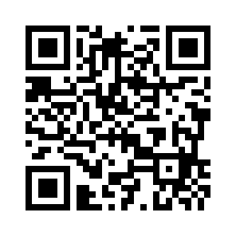

<!--	= ^ . ^ =	-->

<!--
  https://revealjs.com/pdf-export/
  http://localhost:8000/?print-pdf
-->

## Finanzas personales

:::::::::::::: {.columns}
::: {.column width="30%"}

| {.icon-large}
|:--------:|
| [`@tonejito`](https://twitter.com/tonejito)

:::
::: {.column width="40%"}

| 
|:--------:|
| 
| [PDF](./?print-pdf)

:::
::: {.column width="30%"}

|
|:--------:|
| 
| 
| `{nbsp}`

:::
::::::::::::::

--------------------------------------------------------------------------------

# Finanzas personales

--------------------------------------------------------------------------------

# Notas al margen

- _The following content is released under the terms and conditions of the "**works for me license**"_.

- Los puntos que se presentarán a continuación se derivan de la experiencia personal.

- De tener alguna duda buscar asesoría con un experto en el tema (contador, abogado o agente de seguros según sea el caso).

--------------------------------------------------------------------------------

# Agenda

- Modalidades de pago
- Tarjetas bancarias
- Impuestos
- Ahorro para el retiro
- Inversiones

--------------------------------------------------------------------------------

## Modalidades de pago

- Transferencia
- Cheque
- Efectivo

--------------------------------------------------------------------------------

### Pago vía transferencia

- Tarjeta de débito
    - Muchas veces la empresa tramita una tarjeta de nómina utilizando algún convenio
    - Estas tarjetas de nómina no cobran manejo de cuenta

--------------------------------------------------------------------------------

### Pago vía transferencia (_cont_.)

- Existe la _portabilidad de nómina_
    - Mover la nómina que tienes a una tarjeta diferente o de otro banco
    - Esto no se contrapone con tu nómina actual
    - A veces los bancos dan algún beneficio por mover tu nómina con ellos

--------------------------------------------------------------------------------

### Pago vía cheque

Existen dos tipos de cheque

1. Negociable
2. No negociable

🥱 Se que esto parece una clase, pero pon atención si te interesa ser _freelance_ 😴

--------------------------------------------------------------------------------

### Cheque negociable

- Puede ser cobrado en efectivo o ser depositado a una cuenta
- Se puede _endosar_ a otra persona
- La UNAM te puede pagar con cheque

--------------------------------------------------------------------------------

### Cheque no negociable

- Únicamente puede ser cobrado por el destinatario
    - Depósito a cuenta de débito
    - Cobro en efectivo

--------------------------------------------------------------------------------

#### Ejemplo de endose de cheque

Endosar el **cheque negociable** para ti:

- Tipo de operación
    - Para cobro en efectivo
    - Para depósito en cuenta `<num de cuenta>`
- Nombre y firma del destinatario (tú)

Pregunta en el banco antes de escribir el endoso

--------------------------------------------------------------------------------

#### Ejemplo de endose de cheque

Endosar el **cheque negociable** a otra persona:

- Yo _tu nombre_ y firma
- Cedo los derechos del presente documento a
    - Nombre de la persona
    - Dirección de la persona
    - Teléfono de la persona

Pregunta en el banco antes de escribir el endoso

--------------------------------------------------------------------------------

## Tarjetas bancarias

--------------------------------------------------------------------------------

### Mañas de los bancos y las tarjetas bancarias

- **Aléjate de las tarjetas departamentales**
- Fíjate muy bien en las comisiones
    - Anualidad, manejo de cuenta
    - Cargos por pago tardío
    - Comisión por no tener saldo mínimo
    - Comisión por retiro en ventanilla
    - etc.

--------------------------------------------------------------------------------

### Compara las tarjetas para ver cual te conviene

Utiliza el validador oficial de la CONDUSEF:

- <https://tarjetas.condusef.gob.mx/>

Conoce y compara: el CAT, las comisiones, la tasa de interés, los beneficios y los seguros de las diferentes tarjetas de crédito.

> Nota: Este Sitio muestra únicamente tarjetas emitidas por Instituciones Financieras.

--------------------------------------------------------------------------------

#### Tarjeta de débito

Tienes **tu dinero** en la tarjeta

- Utiliza tu número CLABE para que te hagan transferencias
- También puedes dar los 16 dígitos de la tarjeta

**Contrata la protección anti-fraudes que te dan los bancos**

- `#SpoilerAlert`: Es mejor que pagues con una tarjeta de crédito

--------------------------------------------------------------------------------

##### Comprobante de transferencia

El Banco de México permite consultar el Comprobante Electrónico de Pago (CEP) asociado a una transferencia.

- <https://www.banxico.org.mx/cep/>

Siempre valida las transferencias que te hayan realizado, los comprobantes pueden falsificarse

--------------------------------------------------------------------------------

#### Tarjeta de crédito

- Tienes *el crédito que TE PRESTA el banco* en la tarjeta
- Es preferible pagar TODO lo que debes antes de tu fecha de corte
    - Así no generas intereses

Contrata la protección anti-fraudes que te dan los bancos

- El banco muestra interés por investigar los cargos no reconocidos porque es su dinero el que está en juego

--------------------------------------------------------------------------------

#### Tarjeta de crédito (_cont_.)

- Tener una tarjeta de crédito es bueno si la manejas bien
- Generas historial crediticio que te puede servir en el futuro
    - Auto
    - Hipoteca
    - Otro crédito bancario

--------------------------------------------------------------------------------

## Impuestos

> Consigue un buen contador

--------------------------------------------------------------------------------

### Impuestos - Declaración anual

Debes presentar la declaración anual de impuestos en abril si:

- Tienes ingresos de más de `$400K` al año
    - Aunque trabajes en una sola empresa
- Trabajas para 2 o más empresas
    - `<coff>` esquema mixto `</coff>`

- Consigue un buen contador

--------------------------------------------------------------------------------

#### Deducciones personales

- Honorarios médicos
- Lentes
- Intereses por créditos (hipotecario, auto, etc.)
- Aportaciones voluntarias a la AFORE
- Otros, dependiendo el régimen fiscal que tengas

- Consigue un buen contador

--------------------------------------------------------------------------------

### Declaración mensual

Debes presentar la **declaración mensual** si estas en un régimen fiscal que lo exija

- Necesitas tramitar tu RFC, cambiarte al régimen fiscal adecuado
    - También tu contraseña de acceso al SAT y la e-Firma

--------------------------------------------------------------------------------

### Declaración mensual (_cont_.)

- Ojo con los requerimientos del SAT
    - _Lo invitamos a cumplir con sus obligaciones fiscales_
    - Da de alta el _buzón del contribuyente_ en el SAT

- Consigue un buen contador

--------------------------------------------------------------------------------

### Emitir facturas

- Necesitas tramitar tu certificado de sello digital (CSD)
    - Además de la e-Firma y contraseña
- Hay que calcular el monto ANTES de impuestos
    - Se retiene un porcentaje por el IVA y el ISR
    - Se transfiere un porcentaje de IVA a quién emites la factura

- Consigue un buen contador

--------------------------------------------------------------------------------

### FCA: Programa de Asesoría Fiscal Gratuita

La Facultad de Contaduría y Administración puede ayudarte en dudas fiscales e incluso pueden asesorarte para hacer tu declaración fiscal

- <https://asesoriafiscal.fca.unam.mx/>

Posgrado de Contaduría y Administración, segundo piso, cubículos 32 y 33

- L-V de 10-14h y de 16-20h
- 55-5622-8468

--------------------------------------------------------------------------------

### FCA: Programa de Asesoría Fiscal Gratuita (_cont_.)

Este programa ayuda a que los alumnos de contaduría ganen experiencia práctica con los temas fiscales del mundo real.

Siempre hay uno o más profesores responsables que revisan lo que hacen los alumnos durante la asesoría.

--------------------------------------------------------------------------------

## Ahorro para el retiro

--------------------------------------------------------------------------------

### AFORES

- Fondo de ahorro para el retiro
- Da rendimiento bajo, pero es seguro
- Es una inversión a largo plazo
- Si ya estás trabajando segúramente ya tienes una AFORE asignada
    - Puedes cambiarte a la afore que tu quieras
- <https://www.gob.mx/consar>
- <https://www.gob.mx/aforemovil>

--------------------------------------------------------------------------------

#### Ahorro voluntario para el retiro

- Puedes hacer depósitos voluntarios a tu cuenta AFORE
    - ¡Y son deducibles de impuestos! `*`
- Puedes domiciliar depósitos a tu afore con cargo a tu tarjeta de débito
    - Periodicidad mensual, bimestral, semestral o única
- Puedes disponer del dinero de tu cuenta AFORE
    - Consideralo como la última opción

--------------------------------------------------------------------------------

## Inversiones

--------------------------------------------------------------------------------

### CETES

- Respaldado por el gobierno
- Inversión de bajo riesgo
- Rendimiento a largo plazo
- Puedes disponer de tu inversión el mismo día `*`
- <https://www.cetesdirecto.com/>

--------------------------------------------------------------------------------

### Fondos de inversión

- Respaldados por los bancos
    - Probablemente te convenga hablar con un _broker_
- Existen inversiones con diferentes niveles de riesgo
    - Se recomienda hacer un plan de inversión a la medida
    - Cada tipo de inversión tiene sus detalles
    - A mayor riesgo, mayor ganancia **potencial**
- <https://www.gob.mx/cnbv/acciones-y-programas/buscador-y-comparador-de-fondos-de-inversion>

--------------------------------------------------------------------------------

## Palabras finales

- Acércate con un experto
    - Contador, abogado, agente de seguros, _broker_, etc.
- Manten unas finanzas sanas
    - Manten un fondo de ahorro para emergencias
    - No gastes más de lo que ganas
    - No topes tus tarjetas NUNCA
    - Paga TODO lo que debes, no solo el mínimo
    - Alejate de las tarjetas departamentales

--------------------------------------------------------------------------------

## Recursos adicionales

- 📜 [CONDUSEF: Diplomado finanzas personales](https://diplomado.condusef.gob.mx/)
- 📚 [Sofía Macías: "_Pequeño cerdo capitalista_"](https://www.pequenocerdocapitalista.com/)
- 🧚 [Fra Salazar - _El Hada de las Vacantes_](https://ElHadadelasVacantes.com/)
- {.icon-small} [Cristina Palazuelos: `@crisysuscuentas`](https://www.instagram.com/crisysuscuentas/)
- {.icon-small} [Lucía Herrera: `@lucyhereg`](https://www.instagram.com/lucyhereg/)
- {.icon-small} [Vivi Mendoza: `@vivi.meendoza`](https://www.instagram.com/vivi.meendoza/)
- {.icon-small} [Silvia Lozano: `@taxfi_`](https://www.instagram.com/taxfi_/)
- {.icon-small} [Laboralista de Confianza: `@laboralistaconf`](https://twitter.com/laboralistaconf)
- {.icon-small} [Valeria García - _La Konta-Kawaii_](https://twitter.com/ContabiliDarks)
- {.icon-small} [`@WorkingKlassHer`](https://twitter.com/WorkingKlassHer)

--------------------------------------------------------------------------------

# ¿Dudas?

--------------------------------------------------------------------------------

# ¡Gracias!

--------------------------------------------------------------------------------
