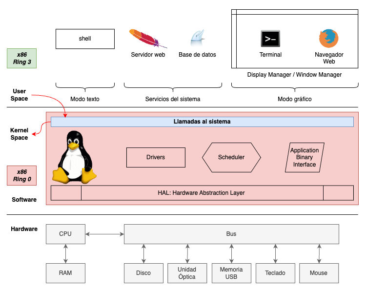

<!--	= ^ . ^ =	-->

# Historia y código abierto

--------------------------------------------------------------------------------

## Historia de UNIX y Linux

--------------------------------------------------------------------------------

### Historia de C y UNIX

:::::::::::::: {.columns}
::: {.column width="100%"}

<div class="container">
  <iframe
    class="responsive-iframe"
    src="https://www.youtube-nocookie.com/embed/t6faJyGB2aY"
    title="YouTube video player"
    frameborder="0"
    allow="accelerometer; autoplay; clipboard-write; encrypted-media; gyroscope; picture-in-picture; web-share"
    allowfullscreen>
  </iframe>
</div>

:::
::::::::::::::

--------------------------------------------------------------------------------

### Historia de C y UNIX

[](img/UNIX_history-simple.svg)

::: notes

- <https://www.redhat.com/sysadmin/unix-linux-history>
- <https://eylenburg.github.io/os_familytree.htm>
- <https://commons.wikimedia.org/wiki/File:Unix_history-simple.svg>

:::

--------------------------------------------------------------------------------

### UNIX
Hereda código de alguna de las versiones directamente derivadas

- BSD, AIX, HP-UX, etc.

<hr/>

### _UNIX-like_
Implementa los mismos conceptos con código propio

- MINIX y Linux

--------------------------------------------------------------------------------

### Historia de **MINIX**

- **MINIX**: Andrew Tanenbaum
- <https://minix3.org/>
- <https://www.linuxjournal.com/article/10754>

--------------------------------------------------------------------------------

### Historia de Linux

- **Linux**: Linus Torvalds 1991
- <https://www.linux.com/news/birth-linux-how-linux-got-started/>


::: notes

- <https://www.linux.com/news/birth-linux-how-linux-got-started/>
- <https://www.oreilly.com/library/view/running-linux-third/156592469X/ch01s02.html>
- <https://commons.wikimedia.org/wiki/File:Tux.svg>

:::

--------------------------------------------------------------------------------

### GNU/Linux

- Linux sólo es el núcleo del sistema
- La mayoría de las veces se acompaña de las utilerías del proyecto GNU
- Por eso se le llama `GNU/Linux`


::: notes

- <https://commons.wikimedia.org/wiki/File:Gnu-and-penguin-color.png>

:::

--------------------------------------------------------------------------------

### Distribuciones de GNU/Linux

[](img/Linux_Distribution_Timeline.svg)

::: notes

- <https://en.wikipedia.org/wiki/File:Linux_Distribution_Timeline.svg>

:::

--------------------------------------------------------------------------------

### Principales distribuciones de GNU/Linux

- Debian / Ubuntu
- Enterprise Linux: Red Hat, CentOS, Rocky Linux, Alma Linux, Oracle Linux
- SUSE / OpenSUSE

--------------------------------------------------------------------------------

## Código abierto y licenciamiento

--------------------------------------------------------------------------------

### Código abierto

- Compartir el _software_
- Acceso al código fuente
- Crear versiones modificadas
- Copy-Left

--------------------------------------------------------------------------------

### Filosofía Open Source

- Richard Stallman
- **FSF**: Free Software Foundation
- **GNU**: GNU is Not UNIX

--------------------------------------------------------------------------------

### Las cuatro libertades del software libre

_«Free as in **freedom**»_

0. Libertad para ejecutar el programa para cualquier propósito
1. Libertad para estudiar el funcionamiento del programa y modificarlo para cualquier propósito
    <!-- - Libre acceso al código fuente -->
2. Libertad de redistribuir copias del programa
3. Libertad de redistribuir versiones modificadas del programa
    <!-- - Libre acceso al código modificado -->

--------------------------------------------------------------------------------

### Licencias para _software_

- Licencia "de dominio público"
- <https://opensource.org/licenses/>
    - **BSD**
    - **MIT** License
    - **GNU GPL**: GNU General Public License
    - Apache Software License
    - Mozilla Public License
    - etc.

<!-- https://www.gnu.org/philosophy/categories.html -->

--------------------------------------------------------------------------------

### Licencias para contenido

- Licencia "de dominio público"
- Creative Commons: <https://choosealicense.org/>
    - CC-BY, CC-BY-SA, CC-BY-NC, CC-BY-NC-SA, CC-BY-ND
- **GNU FDL**: GNU Free Documentation License
- etc.

--------------------------------------------------------------------------------

# Introducción a GNU/Linux

--------------------------------------------------------------------------------

## Intérprete de comandos

--------------------------------------------------------------------------------

### Intérprete de comandos

[](img/hardware-kernel-userspace-shell-x11.png)

--------------------------------------------------------------------------------

### El intérprete de comandos `shell`

- Interfaz de línea de comandos
- No requiere interfaz gráfica
- Lee las entradas del usuario e invoca programas en el sistema operativo
- `sh`, `bash`, `csh`, `ksh`, `zsh`, etc.
- Prompt de usuario (`$`) y de súper-usuario (`#`)
- Argumentos de línea de comandos
- Variables de entorno

--------------------------------------------------------------------------------

### Otras funcionalidades del `shell`

| Comando o atajo 	| Función |
|:---------------------:|:--------|
| `history`		| Historial de comandos
| `Crtl+R`		| Búsqueda en el historial
| `Ctrl+A` / `Ctrl+E`	| Movimiento al principio/final
| `Ctrl+⬅️` / `Ctrl+➡️`	| Movimiento por palabras

--------------------------------------------------------------------------------

### Configuración del `shell`

- Archivo de configuración en el directorio `HOME` del usuario: `~/.bashrc`
- Directivas de configuración del `shell`
    - _Prompt_
    - Instruccion `source`
    - Comandos, funciones y rutinas
    - Aliases
    - Variables de entorno (`export`, `unset`)

--------------------------------------------------------------------------------

### _Scripts_ de `shell`

```
#!/usr/bin/env bash

set -vx

echo "Creando directorios"
for NAME in uno dos tres
do
  mkdir -vp directorios/${NAME}
done

echo "Árbol de directorios creados"
tree directorios
```

--------------------------------------------------------------------------------

## Ayuda en la línea de comandos

--------------------------------------------------------------------------------

### ¿Cómo obtener ayuda en Linux?

- Opciónes `-h` y `--help`
- `pwd`
- `whoami` , `id`
- `which`, `whereis`
- `man`, `info`
- `find`, `locate`

--------------------------------------------------------------------------------

### ¿Cómo identificar el la distribución de GNU/Linux?

- Versión del _kernel_: `uname -a`
- Línea de comandos del _kernel_: `/proc/cmdline`
- Distribución:
    - `/etc/os-release`
    - `/etc/debian_version`
    - `/etc/redhat-release`
    - `lsb_release -a`

::: notes

:::

--------------------------------------------------------------------------------

## Sistema de archivos

--------------------------------------------------------------------------------

### Tipos de sistemas de archivos

- ext2, ext3, ext4
- XFS
- btrfs
- FAT, exFAT
- NTFS
- NFS, SMB

--------------------------------------------------------------------------------

### FHS: Filesystem Hierarchy Standard

- **LSB**: Linux Standard Base
- Define el contenido de cada directorio
- Cada distribución puede tener directorios específicos

--------------------------------------------------------------------------------

| Directorio	| Descripción |
|:-------------:|:------------|
| `/bin`	| Ejecutables esenciales del sistema
| `/sbin`	| Ejecutables esenciales para el súper-usuario
| `/home`	| Carpetas personales de cada usuario
| `/root`	| Directorio `HOME` del usuario `root`
| `/tmp`	| Archivos temporales no persistentes

--------------------------------------------------------------------------------

| Directorio	| Descripción |
|:-------------:|:------------|
| `/boot`	| Configuración de inicio
| `/etc`	| Configuraciones del sistema
| `/dev`	| Archivos de dispositivo del sistema
| `/proc`	| Información sobre los procesos y el sistema operativo
| `/run`	| Archivos volátiles de los programas en ejecución
| `/sys`	| Parámetros volátiles de configuración para el _kernel_

--------------------------------------------------------------------------------

| Directorio	| Descripción |
|:-------------:|:------------|
| `/lib`	| Bibliotecas de código
| `/usr`	| Contiene el _software_ instalado desde paquetes
| `/var`	| Archivos de trabajo de los servicios del sistema
| `/opt`	| Software de terceros que no viene en paquetes
| `/srv`	| Recursos utilizados por algunos servicios de red

--------------------------------------------------------------------------------

| Directorio	| Descripción |
|:-------------:|:------------|
| `/lost+found`	| Contiene los archivos encontrados después de analizar el sistema de archivos
| `/media`	| Discos montados con el _auto-mounter_
| `/mnt`	| Discos montados manualmente

--------------------------------------------------------------------------------

### Tipos de archivo

|     |
|:---:|:--|
| `-` | Archivo
| `d` | Directorio
| `l` | Liga simbólica
| `b` | Dispositivo de bloques
| `c` | Dispositivo de caracteres
| `p` | FIFO (_named pipe_)
| `s` | Socket

--------------------------------------------------------------------------------

### Manejo de archivos

- Los sistemas de archivos distinguen entre mayúsculas y minúsculas
    - ext2, ext3, ext4, xfs, btrfs, reiserfs, etc.

- Algunos otros sistemas de archivos no tienen esta distinción
    - FAT, exFAT, NTFS, HFS`*`, HFS+`*`, APFS`*`

::: notes

- HFS, HFS+ y APFS pueden ser configurados para distinguir entre mayúsulas y minúsculas

:::

--------------------------------------------------------------------------------

### Administración de archivos

Crear archivos vacíos

```bash
$ touch archivo

$ printf "" > archivo

$ echo "Hola mundo" > archivo

$ truncate --size=0 archivo
```

--------------------------------------------------------------------------------

### Administración de archivos

Crear y borrar directorios

```bash
$ mkdir directorio
mkdir: created directory 'directorio'

$ mkdir -p folder/subfolder
mkdir: created directory 'folder'
mkdir: created directory 'folder/subfolder'

$ rmdir -v directorio
rmdir: removing directory 'directorio'

$ rm -vrf folder/
removed directory 'folder/subfolder'
removed directory 'folder/'
```

--------------------------------------------------------------------------------

### Administración de archivos

Renombrar y mover archivos

```bash
$ mv -v archivo mi-archivo
renamed 'archivo' -> 'mi-archivo'

$ mv -v mi-archivo folder/
renamed 'mi-archivo' -> 'folder/mi-archivo'

$ mv -v folder/mi-archivo folder/subfolder/otro-archivo
renamed 'folder/mi-archivo' -> 'folder/subfolder/otro-archivo'
```

--------------------------------------------------------------------------------

### Administración de archivos

Renombrar y mover directorios

```bash
$ mv -v directorio mi-directorio
renamed 'directorio' -> 'mi-directorio'

$ mv -v mi-directorio folder/
renamed 'mi-directorio' -> 'folder/mi-directorio'

$ mv -v folder/mi-directorio folder/subfolder/otro-directorio
renamed 'folder/mi-directorio' -> 'folder/subfolder/otro-directorio'
```

--------------------------------------------------------------------------------

### Administración de archivos

```bash
$ tree folder/
folder/
└── subfolder/
    ├── otro-archivo
    └── otro-directorio/
```

--------------------------------------------------------------------------------

### Administración de archivos

- Ligas duras
- Ligas simbólicas

--------------------------------------------------------------------------------

### Ligas duras

- Agrega "otra liga" al archivo
- Otra entrada en el directorio que apunta al inodo del archivo original
    - Attributo `n-links` en `ls`
- Si se borra una liga dura, el archivo sigue ahí
    - El archivo desaparece hasta que se borren todas las ligas que apuntan a el
- Válido en el mismo sistema de archivos
- No todos los sistemas de archivos lo soportan (FAT, exFAT, etc.)

--------------------------------------------------------------------------------

El parámetro `n-links` aumenta con cada liga dura

```bash
$ touch archivo
$ ls -l archivo
-rw-r--r-- 1 tonejito users 0 Aug 23 02:21 archivo

$ ln -v archivo liga-dura
'liga-dura' => 'archivo'
$ ls -l archivo liga-dura
-rw-r--r-- 2 tonejito users 0 Aug 23 02:21 archivo
-rw-r--r-- 2 tonejito users 0 Aug 23 02:21 liga-dura

$ ln -v archivo otra-liga-dura
'otra-liga-dura' => 'archivo'
$ ls -l archivo liga-dura otra-liga-dura
-rw-r--r-- 3 tonejito users 0 Aug 23 02:21 archivo
-rw-r--r-- 3 tonejito users 0 Aug 23 02:21 liga-dura
-rw-r--r-- 3 tonejito users 0 Aug 23 02:21 otra-liga-dura
```

--------------------------------------------------------------------------------

### Ligas simbólicas

- Archivo especial de tipo "liga simbólica"
- Contiene la ruta de destino (absoluta o relativa)
- Válido en el mismo sistema de archivos o entre diferentes sistemas de archivos
- No todos los sistemas de archivos lo soportan (FAT, exFAT, etc.)

--------------------------------------------------------------------------------

#### Crear una liga simbólica

```bash
$ touch 1-mi-archivo
$ ls -l
-rw-r--r-- 1 tonejito users 0 Aug 23 02:32 1-mi-archivo

$ ln -vs 1-mi-archivo 2-mi-liga-simbolica
'2-mi-liga-simbolica' -> '1-mi-archivo'
$ ls -l
-rw-r--r-- 1 tonejito users  0 Aug 23 02:32 1-mi-archivo
lrwxrwxrwx 1 tonejito users 12 Aug 23 02:33 2-mi-liga-simbolica -> 1-mi-archivo	⬅️
```

--------------------------------------------------------------------------------

#### Crear otra liga simbólica

```bash
$ ln -vs 1-mi-archivo 3-otra-liga-simbolica
'3-otra-liga-simbolica' -> '1-mi-archivo'
$ ls -l
-rw-r--r-- 1 tonejito users  0 Aug 23 02:32 1-mi-archivo
lrwxrwxrwx 1 tonejito users 12 Aug 23 02:33 2-mi-liga-simbolica -> 1-mi-archivo
lrwxrwxrwx 1 tonejito users 12 Aug 23 02:33 3-otra-liga-simbolica -> 1-mi-archivo	⬅️
```

--------------------------------------------------------------------------------

#### Crear una liga simbólica a otra liga simbólica

```bash
$ ln -vs 2-mi-liga-simbolica 4-liga-a-otra-liga
'4-liga-a-otra-liga' -> '2-mi-liga-simbolica'
$ ls -l
-rw-r--r-- 1 tonejito users  0 Aug 23 02:32 1-mi-archivo
lrwxrwxrwx 1 tonejito users 12 Aug 23 02:33 2-mi-liga-simbolica -> 1-mi-archivo
lrwxrwxrwx 1 tonejito users 12 Aug 23 02:33 3-otra-liga-simbolica -> 1-mi-archivo
lrwxrwxrwx 1 tonejito users 19 Aug 23 02:33 4-liga-a-otra-liga -> 2-mi-liga-simbolica	⬅️
```

--------------------------------------------------------------------------------

#### Crear una liga simbólica rota

```bash
$ ln -vs no-existe 5-liga-simbolica-rota
'5-liga-simbolica-rota' -> 'no-existe'
$ ls -l
-rw-r--r-- 1 tonejito users  0 Aug 23 02:32 1-mi-archivo
lrwxrwxrwx 1 tonejito users 12 Aug 23 02:33 2-mi-liga-simbolica -> 1-mi-archivo
lrwxrwxrwx 1 tonejito users 12 Aug 23 02:33 3-otra-liga-simbolica -> 1-mi-archivo
lrwxrwxrwx 1 tonejito users 19 Aug 23 02:33 4-liga-a-otra-liga -> 2-mi-liga-simbolica
lrwxrwxrwx 1 tonejito users  9 Aug 23 02:34 5-liga-simbolica-rota -> no-existe	⬅️
```

--------------------------------------------------------------------------------

#### Crear una liga simbólica a si misma

También llamada "liga circular"

```bash
$ ln -vs 6-liga-circular 6-liga-circular
'6-liga-circular' -> '6-liga-circular'
$ ls -l
-rw-r--r-- 1 tonejito users  0 Aug 23 02:32 1-mi-archivo
lrwxrwxrwx 1 tonejito users 12 Aug 23 02:33 2-mi-liga-simbolica -> 1-mi-archivo
lrwxrwxrwx 1 tonejito users 12 Aug 23 02:33 3-otra-liga-simbolica -> 1-mi-archivo
lrwxrwxrwx 1 tonejito users 19 Aug 23 02:33 4-liga-a-otra-liga -> 2-mi-liga-simbolica
lrwxrwxrwx 1 tonejito users  9 Aug 23 02:34 5-liga-simbolica-rota -> no-existe
lrwxrwxrwx 1 tonejito users 15 Aug 23 02:34 6-liga-circular -> 6-liga-circular	⬅️
```

--------------------------------------------------------------------------------

#### Crear una liga dura a una liga simbólica

```bash
$ ln -v 2-mi-liga-simbolica 7-liga-dura-a-liga-simbolica
'7-liga-dura-a-liga-simbolica' => '2-mi-liga-simbolica'
$ ls -l
-rw-r--r-- 1 tonejito users  0 Aug 23 02:32 1-mi-archivo
lrwxrwxrwx 2 tonejito users 12 Aug 23 02:33 2-mi-liga-simbolica -> 1-mi-archivo
lrwxrwxrwx 1 tonejito users 12 Aug 23 02:33 3-otra-liga-simbolica -> 1-mi-archivo
lrwxrwxrwx 1 tonejito users 19 Aug 23 02:33 4-liga-a-otra-liga -> 2-mi-liga-simbolica
lrwxrwxrwx 1 tonejito users  9 Aug 23 02:34 5-liga-simbolica-rota -> no-existe
lrwxrwxrwx 1 tonejito users 15 Aug 23 02:34 6-liga-circular -> 6-liga-circular
lrwxrwxrwx 2 tonejito users 12 Aug 23 02:33 7-liga-dura-a-liga-simbolica -> 1-mi-archivo	⬅️
```

--------------------------------------------------------------------------------

# `EDITOR`

--------------------------------------------------------------------------------

### Editores de texto

- Todos los editores de texto sirven para lo mismo
- El mejor editor de texto es <u>el que tú sepas manejar</u>
- `vim` / `emacs` / `nano`

::: notes
- <https://en.wikipedia.org/wiki/Editor_war>
:::

--------------------------------------------------------------------------------

### Editor de texto `vim`

- VIM: Vi IMproved
- Editor de texto derivado de `vi`
- Creado por Bram Moolenaar ♱

::: notes
- <https://en.wikipedia.org/wiki/vi>
- <https://en.wikipedia.org/wiki/vim_(text_editor)>
- <https://en.wikipedia.org/wiki/Bram_Moolenaar> ♰
:::

--------------------------------------------------------------------------------

### Configuración de `vim`

- Todo el sistema: `/etc/vim/vimrc.local`
- Usuario actual: `~/.vimrc`
- Configuración útil

```vi
syntax on
set hlsearch
set background=dark
set ruler
set mouse=
```

--------------------------------------------------------------------------------

# Permisos y privilegios

--------------------------------------------------------------------------------

## Permisos del sistema de archivos

--------------------------------------------------------------------------------

### Permisos de archivos y directorios

<div style="font-size: 0.9em; text-align: center;">
`-rw-r-----	tonejito:staff	archivo.txt`
</div>

Modo "simbólico" y modo "octal"

<div style="font-size: 0.7em;">
| Tipo           | Permisos Dueño | Permisos Grupo | Permisos Otros | Dueño      | Grupo   |
|:--------------:|:--------------:|:--------------:|:--------------:|:----------:|:-------:|
| `-`            | `rw-`          | `r--`          | `---`          | `tonejito` | `staff`
| &nbsp;         | `110`          | `100`          | `000`          | &nbsp;     | &nbsp;
| Archivo normal | Lee Escribe    | Lee            | (_ninguno_)    | uid        | gid
| &nbsp;         | `6`            | `4`            | `0`            | `1000`     | `50`
</div>

--------------------------------------------------------------------------------

```bash
$ touch archivo.txt
$ chmod 0640 archivo.txt
$ chown tonejito:staff archivo.txt
$ ls -l archivo.txt
-rw-r----- 1 tonejito staff 0 Aug 19 04:58 archivo.txt
$ stat archivo.txt
  File: archivo.txt
  Size: 0              Blocks: 0      IO Block: 4096  regular empty file
Device: fe05h/65029d   Inode:  65535  Links: 1
Access: (0640/-rw-r-----)  Uid: ( 1000/tonejito)   Gid: (   50/   staff)
Access: 2023-08-19 23:58:59.244000000 -0600
Modify: 2023-08-19 23:58:59.244000000 -0600
Change: 2023-08-19 23:58:59.920000000 -0600
 Birth: 2023-08-19 23:58:59.244000000 -0600
```

--------------------------------------------------------------------------------

### Permisos de lectura: `r`

<div style="font-size: 0.7em;">
| Modo simbólico | Modo Octal <br/> `ugo`	| Permisos Dueño <br/> `u`	| Permisos Grupo <br/> `g`	| Permisos Otros <br/> `o`
|:--------------:|:----------------------------:|:-----------------------------:|:-----------------------------:|:-----------------------:|
| `---------`	 | 000				| `000`				| `000`				| `000`
| `r--------`	 | 400				| **1**`00`			| `000`				| `000`
| `r--r-----`	 | 440				| **1**`00`			| **1**`00`			| `000`
| `r--r--r--`	 | 444				| **1**`00`			| **1**`00`			| **1**`00`
| Representación | **Octal** <br/> `ugo`	| **Bits** <br/> `rwx`		| **Bits** <br/> `rwx`		| **Bits** <br/> `rwx`
</div>

--------------------------------------------------------------------------------

### Permisos de escritura: `w`

<div style="font-size: 0.7em;">
| Modo simbólico | Modo Octal <br/> `ugo`	| Permisos Dueño <br/> `u`	| Permisos Grupo <br/> `g`	| Permisos Otros <br/> `o`
|:--------------:|:----------------------------:|:-----------------------------:|:-----------------------------:|:-----------------------:|
| `rw-------`	 | 600				| **11**`0`			| `000`				| `000`
| `rw-r-----`	 | 640				| **11**`0`			| **1**`00`			| `000`
| `rw-r--r--`	 | 644				| **11**`0`			| **1**`00`			| **1**`00`
| `rw-rw-r--`	 | 664				| **11**`0`			| **11**`0`			| **1**`00`
| `rw-rw-rw-`	 | 666				| **11**`0`			| **11**`0`			| **11**`0`
| Representación | **Octal** <br/> `ugo`	| **Bits** <br/> `rwx`		| **Bits** <br/> `rwx`		| **Bits** <br/> `rwx`
</div>

--------------------------------------------------------------------------------

### Permisos de ejecución: `x`

- `x`: Ejecución **(archivos**)
- `x`: Listar (**directorios**)

<div style="font-size: 0.7em;">
| Modo simbólico | Modo Octal <br/> `ugo`	| Permisos Dueño <br/> `u`	| Permisos Grupo <br/> `g`	| Permisos Otros <br/> `o`
|:--------------:|:----------------------------:|:-----------------------------:|:-----------------------------:|:-----------------------:|
| `rwx------`	 | 700				| **111**			| `000`				| `000`
| `rwxr-x---`	 | 750				| **111**			| **1**`0`**1**			| `000`
| `rwxr-xr-x`	 | 755				| **111**			| **1**`0`**1**			| **1**`0`**1**
| `rwxrwxr-x`	 | 775				| **111**			| **111**			| **1**`0`**1**
| `rwxrwxrwx`	 | 777				| **111**			| **111**			| **111**
| Representación | **Octal** <br/> `ugo`	| **Bits** <br/> `rwx`		| **Bits** <br/> `rwx`		| **Bits** <br/> `rwx`
</div>

--------------------------------------------------------------------------------

## Privilegios de usuario

--------------------------------------------------------------------------------

### Tipos de usuario

| Tipo		| Identificador	| Descripción
|:--------------|:-------------:|:-----------|
| Normal	| `$`		| Usuario normal del equipo
| Sistema	| ` `		| Asociado a servicios del sistema `*`
| Súper-usuario	| `#`		| Administrador del sistema

`*` Los usuarios del sistema NO pueden iniciar sesión en el equipo

--------------------------------------------------------------------------------

### `su`: <u>S</u>witch <u>U</u>ser

- Permite cambiar de usuario
- Pide la contraseña del </u>usuario al que se quiere cambiar</u>
- Sesión interactiva o ejecutar un comando

--------------------------------------------------------------------------------

### man 1 su

- [`su [options] [-] [user [argument...]]`][man-1-su]

```bash
tonejito@debian:~$ su -
tonejito@debian:~$ su -l usuario
tonejito@debian:~$ su -s /bin/bash
tonejito@debian:~$ su -c "comando"
```

[man-1-su]: https://linux.die.net/man/1/su

--------------------------------------------------------------------------------

### `sudo`: <u>S</u>uper <u>U</u>ser <u>DO</u>

- Permite elevar privilegios
- Pide la <u>contraseña del usuario local</u>
- Verifica la configuración en `/etc/sudoers`
- Configuración especializada para restringir comandos

--------------------------------------------------------------------------------

### man 8 sudo

- [`sudo -l [-ABknS] [-g group] [-h host] [-p prompt] [-U user] [-u user] [command]`][man-8-sudo]

```bash
tonejito@debian:~$ sudo -k
tonejito@debian:~$ sudo -l [-U usuario]
tonejito@debian:~$ sudo -i [-U usuario]
tonejito@debian:~$ sudo -s [-U usuario]
tonejito@debian:~$ SHELL=/bin/sh sudo -s [-U usuario]
tonejito@debian:~$ sudo [-u usuario] comando argumentos
```

[man-8-sudo]: https://linux.die.net/man/8/sudo

--------------------------------------------------------------------------------

### `/etc/sudoers`

- Permite dar una configuración granular de cuales comandos se permiten a qué usuarios
- También usa los archivos en el directorio `/etc/sudoers.d`
- Comúnmente se utiliza el grupo `sudo` para dar privilegios a los usuarios
- Sintaxis: `Defaults`, `Alias` y reglas

--------------------------------------------------------------------------------

```bash
root@debian:~# egrep -v '^#|^\s*$' /etc/sudoers
Defaults	env_reset
Defaults	mail_badpass
Defaults	secure_path="/usr/local/sbin:/usr/local/bin:/usr/sbin:/usr/bin:/sbin:/bin"
root		ALL=(ALL:ALL) ALL
%sudo		ALL=(ALL:ALL) ALL
@includedir /etc/sudoers.d
```

--------------------------------------------------------------------------------

# Administración de paquetes

--------------------------------------------------------------------------------

### Debian: `dpkg`

- Manejador de paquetes `deb`
- Puedes instalar un programa con el paquete `deb`

--------------------------------------------------------------------------------

```bash
root@debian:~# dpkg -l
```

```bash
root@debian:~# dpkg -i paquete.deb
```

--------------------------------------------------------------------------------

### Debian: `apt`

- Similares: `apt-get`, `aptitude`, `apt`
- Permite instalar _software_ en el sistema utilizando paquetes `deb`
- Buscar paquetes: <https://packages.debian.org/>
- Repositorios: `main`, `contrib`, `non-free`
- Existen repositorios de terceros (ej, `virtualbox`)

--------------------------------------------------------------------------------

### Administrar _software_ con APT

```bash
root@debian:~# apt update
root@debian:~# apt upgrade
root@debian:~# apt dist-update
```

```bash
root@debian:~# apt install apache2
root@debian:~# apt remove nginx
root@debian:~# apt purge apache2-doc
```

--------------------------------------------------------------------------------

### FlatPak

- Permite instalar _software_ más reciente que el disponible en los repositorios de la distribución
- El formato FlatPak sirve en casi cualquier distribución de GNU/Linux
- El _software_ se distribuye a través de [`FlatHub`][flathub]

[flathub]: https://flathub.org/setup

--------------------------------------------------------------------------------

### Instalar FlatPak en Debian

```bash
root@debian:~# apt install flatpak
root@debian:~# apt install gnome-software-plugin-flatpak
```

```bash
root@debian:~# flatpak remote-add --if-not-exists flathub \
               https://dl.flathub.org/repo/flathub.flatpakrepo
```

```
root@debian:~# reboot
```

--------------------------------------------------------------------------------

### Instalar y ejecutar _software_ con FlatPak

- <https://flathub.org/apps/search>

```bash
tonejito@debian:~$ flatpak install flathub org.mozilla.firefox
```

```bash
tonejito@debian:~$ flatpak run org.mozilla.firefox
```

--------------------------------------------------------------------------------

# Servicios del sistema

--------------------------------------------------------------------------------

## SystemD

--------------------------------------------------------------------------------

### SystemD

- Maneja el inicio de los servicios en al mayoría de las distribuciones modernas de GNU/Linux
- Se ejecuta un demonio central llamado `systemd` con PID 1
- Cada elemento administrado por SystemD se define en un _unit file_
- Los _unit files_ se encuentran en `/lib/systemd/system` o `/etc/systemd/system`
- Se administra con el comando `systemctl`

--------------------------------------------------------------------------------

```
# systemctl reboot
# systemctl daemon-reload
# systemctl list-units
# systemctl status|is-active <unit>
# systemctl start|stop|restart <unit>
# systemctl enable|disable <unit>
```

--------------------------------------------------------------------------------

### SystemD

- Units:

    - Service
    - Timer
    - Mount
    - Device

- Se utiliza `journalctl` para acceder a las bitácoras generadas por SystemD

```
# journalctl -xe
```

--------------------------------------------------------------------------------
