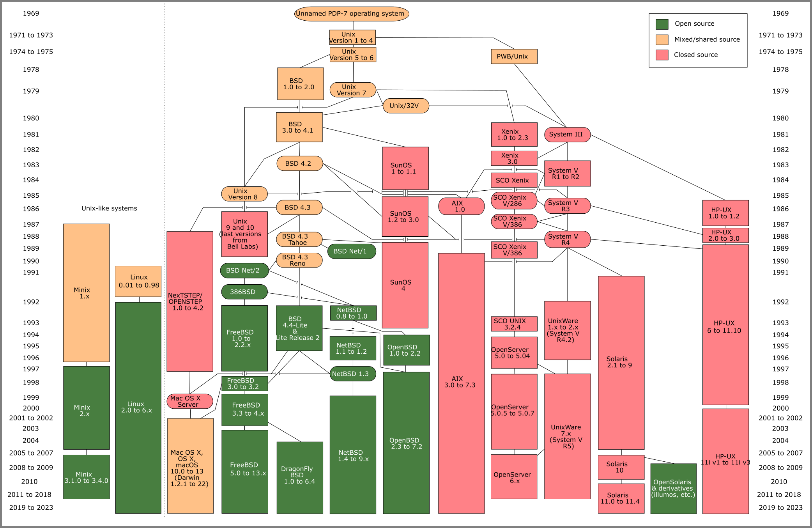
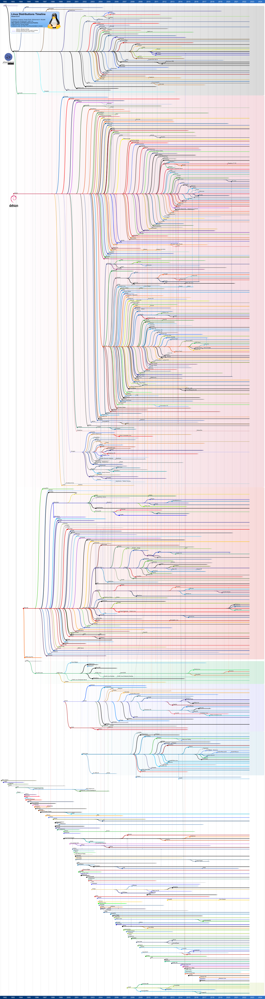

<!--	= ^ . ^ =	-->

### Historia de C y UNIX

:::::::::::::: {.columns}
::: {.column width="100%"}

<div class="container">
  <iframe
    class="responsive-iframe"
    src="https://www.youtube-nocookie.com/embed/t6faJyGB2aY"
    title="YouTube video player"
    frameborder="0"
    allow="accelerometer; autoplay; clipboard-write; encrypted-media; gyroscope; picture-in-picture; web-share"
    allowfullscreen>
  </iframe>
</div>

:::
::::::::::::::

--------------------------------------------------------------------------------

### Historia de C y UNIX

[](img/UNIX_history-simple.svg)

::: notes

- <https://eylenburg.github.io/os_familytree.htm>
- <https://commons.wikimedia.org/wiki/File:Unix_history-simple.svg>

:::

--------------------------------------------------------------------------------

### Historia de **MINIX**

- **MINIX**: Andrew Tanenbaum
- <https://www.linuxjournal.com/article/10754>
- <https://minix3.org/>

--------------------------------------------------------------------------------

### Historia de Linux

- **Linux**: Linus Torvalds 1991


::: notes

- <https://www.linuxjournal.com/article/10754>
- <https://commons.wikimedia.org/wiki/File:Tux.svg>

:::

--------------------------------------------------------------------------------

### GNU/Linux

- Linux solo es el núcleo del sistema
- La mayoría de las veces se acompaña de las utilerías del proyecto GNU
- Por eso se le llama `GNU/Linux`


::: notes

- <https://commons.wikimedia.org/wiki/File:Gnu-and-penguin-color.png>

:::

--------------------------------------------------------------------------------

### Distribuciones de GNU/Linux

[](img/Linux_Distribution_Timeline.svg)

::: notes

- <https://en.wikipedia.org/wiki/File:Linux_Distribution_Timeline.svg>

:::

--------------------------------------------------------------------------------

### Principales distribuciones de GNU/Linux

- Debian / Ubuntu
- Enterprise Linux: Red Hat, CentOS, Rocky Linux, Alma Linux, Oracle Linux
- SUSE / OpenSUSE

--------------------------------------------------------------------------------

### Código abierto

- Compartir el _software_
- Acceso al código fuente
- Crear versiones modificadas
- Copy-Left

--------------------------------------------------------------------------------

### Filosofía Open Source

- Richard Stallman
- **FSF**: Free Software Foundation
- **GNU**: GNU is Not UNIX

--------------------------------------------------------------------------------

### Las cuatro libertades del software libre

_«Free as in **freedom**»_

0. Libertad para ejecutar el programa para cualquier propósito
1. Libertad para estudiar el funcionamiento del programa y modificarlo para cualquier propósito
    <!-- - Libre acceso al código fuente -->
2. Libertad de redistribuir copias del programa
3. Libertad de redistribuir versiones modificadas del programa
    <!-- - Libre acceso al código modificado -->

--------------------------------------------------------------------------------

### Licencias para _software_

- Licencia "de dominio público"
- <https://opensource.org/licenses/>
    - **BSD**
    - **MIT** License
    - **GNU GPL**: GNU General Public License
    - Apache Software License
    - Mozilla Public License
    - etc.

<!-- https://www.gnu.org/philosophy/categories.html -->

--------------------------------------------------------------------------------

### Licencias para contenido

- Licencia "de dominio público"
- Creative Commons: <https://choosealicense.org/>
    - CC-BY, CC-BY-SA, CC-BY-NC, CC-BY-NC-SA, CC-BY-ND
- **GNU FDL**: GNU Free Documentation License
- etc.

--------------------------------------------------------------------------------

# Línea de comandos

--------------------------------------------------------------------------------

### El intérprete de comandos `shell`

- Interfaz de línea de comandos
- No requiere interfaz gráfica
- Lee las entradas del usuario e invoca programas en el sistema operativo
- `sh`, `bash`, `csh`, `ksh`, `zsh`, etc.
- Prompt de usuario (`$`) y de súper-usuario (`#`)
- Argumentos de línea de comandos
- Variables de entorno

--------------------------------------------------------------------------------

### Configuración del `shell`

- Archivo de configuración en el directorio `HOME` del usuario: `~/.bashrc`
- Directivas de configuración del `shell`
    - _Prompt_
    - Instruccion `source`
    - Comandos, funciones y rutinas
    - Aliases
    - Variables de entorno (`export`, `unset`)

--------------------------------------------------------------------------------

### ¿Cómo obtener ayuda en Linux?

- Opciónes `-h` y `--help`
- `pwd`
- `whoami` , `id`
- `which`, `whereis`
- `man`, `info`
- `find`, `locate`

--------------------------------------------------------------------------------

### ¿Cómo identificar el la distribución de GNU/Linux?

- Versión del _kernel_: `uname -a`
- Línea de comandos del _kernel_:
    - `cat /proc/cmdline`
- Distribución:
    - `cat /etc/os-release /etc/debian_version /etc/redhat-release`
    - `lsb_release -a`

::: notes

:::

--------------------------------------------------------------------------------

### FHS: Filesystem Hierarchy Standard

- **LSB**: Linux Standard Base
- Define el contenido de cada directorio
- Cada distribución puede tener directorios específicos

--------------------------------------------------------------------------------

| Directorio	| Descripción |
|:-------------:|:------------|
| `/bin`	| Ejecutables esenciales del sistema
| `/sbin`	| Ejecutables esenciales para el súper-usuario
| `/home`	| Carpetas personales de cada usuario
| `/root`	| Directorio `HOME` del usuario `root`
| `/tmp`	| Archivos temporales no persistentes

--------------------------------------------------------------------------------

| Directorio	| Descripción |
|:-------------:|:------------|
| `/boot`	| Configuración de inicio
| `/etc`	| Configuraciones del sistema
| `/dev`	| Archivos de dispositivo del sistema
| `/proc`	| Información sobre los procesos y el sistema operativo
| `/run`	| Archivos volátiles de los programas en ejecución
| `/sys`	| Parámetros volátiles de configuración para el _kernel_

--------------------------------------------------------------------------------

| Directorio	| Descripción |
|:-------------:|:------------|
| `/lib`	| Bibliotecas de código
| `/usr`	| Contiene el _software_ instalado desde paquetes
| `/var`	| Archivos de trabajo de los servicios del sistema
| `/opt`	| Software de terceros que no viene en paquetes
| `/srv`	| Recursos utilizados por algunos servicios de red

--------------------------------------------------------------------------------

| Directorio	| Descripción |
|:-------------:|:------------|
| `/lost+found`	| Contiene los archivos encontrados después de analizar el sistema de archivos
| `/media`	| Discos montados con el _auto-mounter_
| `/mnt`	| Discos montados manualmente

--------------------------------------------------------------------------------

### Administración de archivos

- Tipos de archivo
- Creación de directorios
- Creación de archivos
- Renombrar y mover archivos
- Renombrar y mover directorios
- Permisos en archivos

--------------------------------------------------------------------------------

### Administración de archivos

- Ligas simbólicas
- Ligas duras

--------------------------------------------------------------------------------

### Otras funcionalidades del `shell`

| Comando o atajo 	| Función |
|:---------------------:|:--------|
| `history`		| Historial de comandos
| `Crtl+R`		| Búsqueda en el historial
| `Ctrl+A` / `Ctrl+E`	| Movimiento al principio/final
| `Ctrl+⬅️` / `Ctrl+➡️`	| Movimiento por palabras

--------------------------------------------------------------------------------

### _Scripts_ de `shell`

--------------------------------------------------------------------------------

# `EDITOR`

--------------------------------------------------------------------------------

### Editores de texto

- Todos los editores de texto sirven para lo mismo
- El mejor editor de texto es <u>el que tú sepas manejar</u>
- `vim` / `emacs` / `nano`

::: notes
- <https://en.wikipedia.org/wiki/Editor_war>
:::

--------------------------------------------------------------------------------

### Editor de texto `vim`

- VIM: Vi IMproved
- Editor de texto derivado de `vi`
- Creado por Bram Moolenaar ♱

::: notes
- <https://en.wikipedia.org/wiki/vi>
- <https://en.wikipedia.org/wiki/vim_(text_editor)>
- <https://en.wikipedia.org/wiki/Bram_Moolenaar> ♰
:::

--------------------------------------------------------------------------------

### Configuración de `vim`

- Todo el sistema: `/etc/vim/vimrc.local`
- Usuario actual: `~/.vimrc`
- Configuración útil

```vi
syntax on
set hlsearch
set background=dark
set ruler
set mouse=
```

--------------------------------------------------------------------------------

# Privilegios de usuario

--------------------------------------------------------------------------------

### Tipos de usuario

| Tipo | Identificador | Descripción
|:-----|:-------------:|:-----------|
| Normal	| `$`	| Usuario normal del equipo
| Sistema	| `​`	| Asociado a servicios del sistema `*`
| Súper-usuario	| `#`	| Administrador del sistema

`*` Los usuarios del sistema NO pueden iniciar sesión en el equipo

--------------------------------------------------------------------------------

### Permisos del sistema de archivos

- `-rw-r-----	tonejito:staff	archivo.txt`

Modo "simbólico" y modo "octal"

<div style="font-size: 0.7em;">
| Tipo           | Permisos Dueño | Permisos Grupo | Permisos Otros | Dueño      | Grupo   |
|:--------------:|:--------------:|:--------------:|:--------------:|:----------:|:-------:|
| `-`            | `rw-`          | `r--`          | `---`          | `tonejito` | `staff`
| &nbsp;         | `110`          | `100`          | `000`          | &nbsp;     | &nbsp;
| Archivo normal | Lee Escribe    | Lee            | (_ninguno_)    | uid        | gid
| &nbsp;         | `6`            | `4`            | `0`            | `1000`     | `50`
</div>

--------------------------------------------------------------------------------

```
$ touch archivo.txt
$ chmod 0640 archivo.txt
$ chown tonejito:staff archivo.txt
$ ls -l archivo.txt
-rw-r----- 1 tonejito staff 0 Aug 19 04:58 archivo.txt
$ stat archivo.txt
  File: archivo.txt
  Size: 0              Blocks: 0      IO Block: 4096  regular empty file
Device: fe05h/65029d   Inode:  65535  Links: 1
Access: (0640/-rw-r-----)  Uid: ( 1000/tonejito)   Gid: (   50/   staff)
Access: 2023-08-19 23:58:59.244000000 -0600
Modify: 2023-08-19 23:58:59.244000000 -0600
Change: 2023-08-19 23:58:59.920000000 -0600
 Birth: 2023-08-19 23:58:59.244000000 -0600
```
