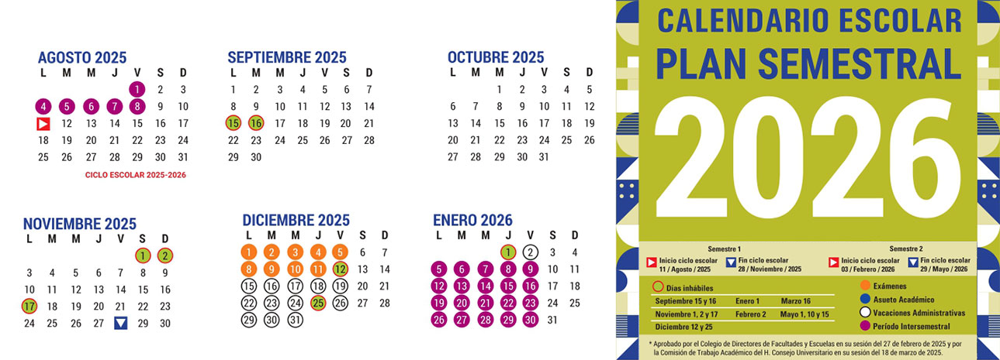

<!--	= ^ . ^ =	-->

#	Presentación del curso

Sistemas Operativos, Facultad de Ciencias, UNAM

Semestre 2026-2

- José Luis Torres Rodríguez
- Andrés Leonardo Hernández Bermúdez

--------------------------------------------------------------------------------

##	Requisitos

- Conocimientos básicos de GNU/Linux
- Conocimientos de Sistemas Operativos
- Conocimientos de programación en un lenguaje estructurado u orientado a objetos (idealmente C ó Python)

--------------------------------------------------------------------------------

##	Requisitos (cont.)

- No tener materias encimadas en el horario de este curso
- Asistencia regular a clase
- Revisión regular del material del curso
- La asistencia a las sesiones de laboratorio es **obligatoria**
- Entrega en tiempo y forma de las tareas indicadas

--------------------------------------------------------------------------------

##	Objetivos

- Conocer y comprender los conceptos, técnicas y algoritmos más importantes involucrados en redes de computadoras
- Conocer los modelos de referencia empleados para la especificación de redes y hacer una revisión de TCP/IP

--------------------------------------------------------------------------------

##	Objetivos (cont.)

- Adquirir conocimientos acerca de la creación de una red y aplicaciones para redes
- Adquirir conocimientos acerca de la implementación de diversos servicios de red, en sistemas GNU/Linux

--------------------------------------------------------------------------------

##	Objetivos (cont.)

- Estudiar las caracterísitcas de las redes más conocidas y usadas actualmente
- Tener un panorama de las posibilidades, implicaciones, ventajas y riesgos del uso de una red

--------------------------------------------------------------------------------

##	Objetivos (cont.)

- Abordar temás básicos de seguridad en redes a nivel práctico
- Obtener conocimientos de administración de sistemas GNU/Linux enfocados a redes, mediante la revisión de comandos y aplicaciones propios del sistema operativo

--------------------------------------------------------------------------------

##	Sistemas Operativos

- GNU/Linux
- BSD
- Windows

##	Lenguaje de programación

- C
- `bash`

--------------------------------------------------------------------------------

##	Impartición de las clases

--------------------------------------------------------------------------------

###	Primera sesión para presentar los detalles del curso

La primera sesión se llevará a cabo en línea el día lunes 11 de agosto de 2025 a las 17:30 horas en el salón P207, en ésta se abordarán detalles acerca de la impartición del curso y se resolverán las dudas que puedan surgir a los interesados en el mismo.

--------------------------------------------------------------------------------

###	Modalidad del curso

Los detalles acerca de la impartición de las clases se indicarán durante la primera sesión, **considerando que la modalidad del curso está establecida como mixta**.

--------------------------------------------------------------------------------

###	Teoría

**Profesor**

- Videos pre-grabados en el [canal de YouTube][youtube] de la materia
- Lunes y miércoles de 17:30 a 19:00 hrs [Salón `P103`][salon-P103] y via [Zoom][zoom]

**Ayudante**

- Videos pre-grabados en el [canal de YouTube][youtube] de la materia
- Martes y jueves de 17:30 a 18:30 hrs [Salón `P103`][salon-P103] y via [Zoom][zoom]

<!--
**Sesión de dudas**

- Jueves de 17:00 a 18:30 horas [a través de Google Meet][google-meet]
- Para resolver las dudas existentes sobre los temas y materiales entregados a lo largo de la semana

**NOTA**: Algunas sesiones de teoría y laboratorio serán impartidas via [Google Meet][google-meet] o [Zoom][zoom]

-->

--------------------------------------------------------------------------------

###	Laboratorio

Se llevarán a cabo una serie de prácticas con el objetivo de que el alumno se familiarice con el lenguaje de programación C y para reforzar los temas abordados en las sesiones teóricas.

Durante las sesiones de laboratorio se les compartirán los detalles acerca de las prácticas, las cuales se deberán trabajar para su entrega posterior en las fechas indicadas.

--------------------------------------------------------------------------------

###	Laboratorio (cont.)

<!--
Viernes de 18:00 a 20:00 hrs. [Taller de Sistemas Operativos, Redes de Cómputo, Sistemas Distribuidos y Manejo de Información, Edificio Tlahuizcalpan][taller-Tlahuizcalpan]
-->

- Se subirán las especificaciones de las prácticas en la [sección de laboratorio en la página del curso][pagina-actividad-practicas] y se hará saber la fecha de entrega
- Todas las prácticas deberán ser entregadas a través de _merge request_ siguiendo el [flujo de trabajo de entrega][flujo-de-trabajo]

<!--
- Habrá dos proyectos principales: uno a mitad del curso y otro al finalizar. Estos proyectos tienen como objetivo fijar los conocimientos adquiridos en la parte teórica del curso

- Toda la información acerca de las sesiones del laboratorio se encuentra en la [sección de prácticas][practicas] de la página web

- La asistencia a las sesiones de laboratorio es obligatoria
-->

--------------------------------------------------------------------------------

##	Recursos de cómputo

- Se utilizará [Google Drive][google-drive] para realizar trabajo colaborativo en equipo y para la entrega de algunas tareas
- [GitLab][gitlab-grupo] para la entrega de proyectos de programación y la documentación correspondiente
- Se hará uso de un [grupo en Telegram][telegram] para comunicación grupal y personal

--------------------------------------------------------------------------------

##	Recursos de cómputo (cont.)

- Se hará uso de una lista de correo para comunicación grupal, esta lista se formará a partir de las cuentas de correo de los alumnos inscritos al grupo

    - **Página web del curso**: <https://Redes-Ciencias-UNAM.gitlab.io/>
    - **Grupo de chat**: <a href="https://&#116;&#46;&#x6d;&#x65;/&#114;&#x65;&#100;&#x65;&#x73;&#x5f;&#x63;&#x69;&#x65;&#110;&#x63;&#x69;&#x61;&#x73;&#x5f;&#x75;&#110;&#x61;&#x6d;">
        https://&#116;&#46;&#x6d;&#x65;/&#114;&#x65;&#100;&#x65;&#x73;&#x5f;&#x63;&#x69;&#x65;&#110;&#x63;&#x69;&#x61;&#x73;&#x5f;&#x75;&#110;&#x61;&#x6d;
    </a>
    - **Correo electrónico**: <a class="email" href="mailto&colon;&#114;&#x65;&#100;&#x65;&#x73;&commat;&#x63;&#x69;&#x65;&#110;&#x63;&#x69;&#x61;&#x73;&#46;&#x75;&#110;&#x61;&#x6d;&#46;&#x6d;&#120;">
        &#114;&#x65;&#100;&#x65;&#x73;@&#x63;&#x69;&#x65;&#110;&#x63;&#x69;&#x61;&#x73;&#46;&#x75;&#110;&#x61;&#x6d;&#46;&#x6d;&#120;
    </a>

--------------------------------------------------------------------------------

##	Recursos de cómputo (cont.)

Se compartirán recursos adicionales a la cuenta de correo institucional `@ciencias` en caso de ser requerido
- [Google Meet][google-meet] o [Zoom][zoom] para las sesiones de dudas
- Carpeta de [Google Drive][google-drive] para trabajo colaborativo y la entrega de algunas tareas
- [Canal de Youtube][youtube] para la publicación de videos sobre el curso

--------------------------------------------------------------------------------

####	Calendario FCiencias

[][calendario-fciencias-academicos]

--------------------------------------------------------------------------------

####	Calendario UNAM

[][calendario-dgae]

--------------------------------------------------------------------------------

##	Temario

0. Propedéutico

    1. Introducción a GNU/Linux
    2. Control de versiones con `git`

--------------------------------------------------------------------------------

##	Temario (cont.)

1. Introducción a redes de computadoras

    1. Conceptos de redes de computadoras
    2. Clasificación de las redes
    3. Modelos de referencia

--------------------------------------------------------------------------------

##	Temario (cont.)

2. Capa física
3. Capa de enlace
4. Capa de red
5. Capa de transporte
6. Capa de aplicación

--------------------------------------------------------------------------------

##	Temario (cont.)

7. Implementación de una red
    1. Servicios de red en sistemas GNU/Linux
    2. Monitoreo de una red
    3. Seguridad en redes
8. Temas adicionales de aplicaciones en redes

--------------------------------------------------------------------------------

##	Evaluación del semestre

Se considerarán los siguientes elementos para llevar a cabo la evaluación:

<!--
####	Asistencia regular a clase
-->

--------------------------------------------------------------------------------

###	Examenes

Se aplicarán 4 examenes, de acuerdo al avance que se tenga en el curso

| Examen	| Fecha					|
|--------------:|:--------------------------------------|
| Parcial 1	| Miércoles	25 de febrero	de 2026
| Parcial 2	| Miércoles	25 de marzo	de 2026
| Parcial 3	| Miércoles	29 de abril	de 2026
| Parcial 4	| Miércoles	26 de mayo	de 2026

**NOTA**: Las fechas están sujetas a cambios

--------------------------------------------------------------------------------

####	Requisitos para presentar examen

- Haber entregado puntualmente las tareas anteriores a la fecha del examen
- No habrá reposiciones de examenes
- Es requisito indispensable el contar con un promedio aprobatorio en los examenes y haberlos presentado todos, sin excepción, para tener derecho a obtener una calificación final aprobatoria en el semestre
- **No es posible obtener una calificación aprobatoria si no se presentaron los exámenes**.

--------------------------------------------------------------------------------

###	Prácticas

- Prácticas sobre cada uno de los temas principales vistos a lo largo del semestre
- Es requisito indispensable el haber entregado todas las prácticas para tener derecho a obtener una calificación final aprobatoria en el semestre
- **No es posible obtener una calificación aprobatoria si no se ha cumplido con la entrega de las prácticas y los proyectos asignados durante el semestre**.

<!--
###	Exposiciones

- Se propondrá una lista de temas a exponer "en equipo"
- Cada equipo contará con al menos tres semanas para la preparación del tema correspondiente
-->

--------------------------------------------------------------------------------

###	Tareas teórico-prácticas

- En estas tareas se aplicarán todos los conocimientos vistos a la fecha, complementados con material adicional

<!--

###	Participaciones en clase

- Éstas son **OBLIGATORIAS** y son un elemento fundamental en la evaluación final
- Se tomarán en cuenta sobre todo aquellas participaciones que refuercen lo visto en clase y que constituyan una aportación importante a la misma
-->

--------------------------------------------------------------------------------

##	Notas

- La entrega de todos los trabajos será improrrogable
- Todos los trabajos duplicados serán evaluados con cero, sin hacer indagaciones

--------------------------------------------------------------------------------

##	Notas (cont.)

- Las tareas y prácticas se deberán trabajar **en equipo**, se indicará la cantidad de integrantes que puede tener cada equipo
    - El trabajo <u>en equipo</u> se evalua considerando la participación de todos los integrantes
- Se debe considerar que la forma de trabajo en equipo **no es opcional**
    - Las prácticas y proyectos están diseñados para llevarse a cabo en equipo, por lo que estos <u>no se pueden asignar de manera individual</u>

--------------------------------------------------------------------------------

##	Notas (cont.)

- La calificación final se entregará a más tardar el día de la segunda vuelta de los examenes finales
    - Esta fecha también es el límite para solicitar aclaraciones de cualquier trabajo entregado

<!--
- Quien no se presente el día señalado a recibir su calificación está aceptando la evaluación que se haga de su trabajo durante el semestre
-->

--------------------------------------------------------------------------------

##	Notas (cont.)

- Sin excepción, no se aceptarán reclamaciones fuera de la fecha señalada en el punto anterior
- Sin excepciones, no se permitirá renunciar a ninguna calificación
- La calificación de `NP` sólo se asignará a quien no haya entregado ningún trabajo y no haya presentado ningún examen

--------------------------------------------------------------------------------

##	Notas (cont.)

- De ninguna manera se dará un trato ni una calificación especial a ningún estudiante, por el hecho de trabajar, tener un promedio alto en su historial académico, contar con algún tipo de beca o tener materias encimadas
- Tampoco se tomarán en cuenta recomendaciones de ninguna persona para asignar la calificación final

--------------------------------------------------------------------------------

##	Evaluación

La calificación final se calculará en base a los siguientes porcentajes:

| Elemento			|Valor
|------------------------------:|:------|
| [Tareas][tareas]		| 20%
| [Prácticas][practicas]	| 50%
| [Examenes][examenes]		| 30%
<!--
| [Proyectos][proyectos]	| 15%
-->

Las participaciones que aporten ideas a la clase pueden ayudar a incrementar la calificación final

--------------------------------------------------------------------------------

##	Bibliografía

- Computer Networking: a top down approach. 6th edition, Kurose, James F., Ross, Keith W., Addison Wesley
    - [Biblioteca Digital, UNAM][kurose-bidiunam-busqueda]
    - [Catálogo LIBRUNAM][kurose-librunam-catalogo]
    - [Búsqueda LIBRUNAM][kurose-librunam-busqueda]

- Redes de computadoras, Tanenbaum, Andrew S., Pearson/Prentice Hall
    - [Biblioteca Digital, UNAM][tanenbaum-bidiunam-busqueda]
    - [Catálogo LIBRUNAM][tanenbaum-librunam-catalogo]

--------------------------------------------------------------------------------

##	Ligas de interés

- [Fechas oficiales][calendario-fciencias-estudiantes] del semestre 2026-2 aprobadas por el Consejo Técnico de la FC
- [Calendario escolar][calendario-unam] en la [página de la DGAE][calendario-dgae]
- [Temario][curso-temario] en la página de la Facultad de Ciencias
- [Detalles del curso][curso-detalles] en la página de la Facultad de Ciencias
- [Presentación][curso-presentacion] en la página de la Facultad de Ciencias
- Horarios en la página de la Facultad de Ciencias: [plan 1994][horarios-plan-1994], [plan 2013][horarios-plan-2013]
- [Lista del grupo][curso-lista]

--------------------------------------------------------------------------------

##	Tareas

- Crear una cuenta en GitLab asociada al correo `@ciencias`
    - No utilizar Google/GitHub/etc. para iniciar sesión
- Utilizaremos una máquina virtual de GNU/Linux para las tareas y prácticas
    - Necesitamos permisos administrativos en esa máquina virtual
- Utilizaremos Python para instalar algunas herramientas del [flujo de trabajo][flujo-de-trabajo]

--------------------------------------------------------------------------------

##	Dudas u observaciones adicionales

--------------------------------------------------------------------------------

##	Ligas

:::::::::::::: {.columns}
::: {.column width="33%"}

| [Chat Telegram](https://t.me/redes_ciencias_unam)
|:--------:|
| 

:::
::: {.column width="33%"}

| [Sitio   web](https://Redes-Ciencias-UNAM.gitlab.io/)
|:--------:|
| 

:::
::: {.column width="33%"}

| [Canal YouTube](https://www.youtube.com/c/RedesCienciasUNAM)
|:--------:|
| 

:::
::::::::::::::

:::::::::::::: {.columns}
::: {.column width="50%"}

| Lista de correo dudas
|:--------:|
| 

:::
::: {.column width="50%"}

| Lista de correo avisos
|:--------:|
| 

:::
::::::::::::::

--------------------------------------------------------------------------------

[calendario-dgae-crop]: https://tonejito.github.io/talks/presentacion-redes/img/semestral2026.jpg
[calendario-dgae]: https://www.dgae.unam.mx/calendarios_escolares.html
[calendario-fciencias-academicos]: https://www.fciencias.unam.mx/estudiar-en-ciencias/calendario/academicos
[calendario-fciencias-crop]: https://tonejito.github.io/talks/presentacion-redes/img/calendario-fciencias.png
[calendario-fciencias-estudiantes]: https://www.fciencias.unam.mx/estudiar-en-ciencias/calendario/estudiantes
[calendario-fciencias]: https://www.fciencias.unam.mx/estudiar-en-ciencias/calendario
[calendario-unam]: https://www.dgae.unam.mx/assets/images/semestral2026.jpg
[calendario]: https://Redes-Ciencias-UNAM.gitlab.io/curso/calendario

[curso-detalles]: https://www.fciencias.unam.mx/docencia/horarios/detalles/369972
<!-- [curso-temario]: https://www.fciencias.unam.mx/asignaturas/714.pdf -->
[curso-temario]: https://www.fciencias.unam.mx/sites/default/files/temario/714.pdf
[curso-lista]: https://tinyurl.com/Lista-Redes-2026-2
[curso-presentacion]: https://www.fciencias.unam.mx/docencia/horarios/presentacion/369972

[pagina-tareas]: https://Redes-Ciencias-UNAM.gitlab.io/2026-2/tareas-redes
[flujo-de-trabajo]: https://Redes-Ciencias-UNAM.gitlab.io/workflow/

[repositorio-tareas-practicas-milestones]: https://gitlab.com/Redes-Ciencias-UNAM/2026-2/tareas-redes/-/milestones?sort=start_date_asc&state=all
[repositorio-tareas-practicas-merge-requests]: https://gitlab.com/Redes-Ciencias-UNAM/2026-2/tareas-redes/-/merge_requests
[repositorio-tareas-practicas]: https://gitlab.com/Redes-Ciencias-UNAM/2026-2/tareas-redes
[repositorio-tareas]: https://gitlab.com/Redes-Ciencias-UNAM/2026-2/tareas-redes

[gitlab-grupo]: https://gitlab.com/Redes-Ciencias-UNAM/
[horarios-plan-1994]: https://www.fciencias.unam.mx/docencia/horarios/20262/218/714
[horarios-plan-2013]: https://www.fciencias.unam.mx/docencia/horarios/20262/1556/714

[pagina-curso]: https://Redes-Ciencias-UNAM.gitlab.io/
[tareas]: https://Redes-Ciencias-UNAM.gitlab.io/tareas/
[pagina-actividad-tareas]: https://Redes-Ciencias-UNAM.gitlab.io/tareas/
[practicas]: https://Redes-Ciencias-UNAM.gitlab.io/practicas/
[pagina-actividad-practicas]: https://Redes-Ciencias-UNAM.gitlab.io/practicas/
[examenes]: https://Redes-Ciencias-UNAM.gitlab.io/examenes/
[pagina-actividad-examenes]: https://Redes-Ciencias-UNAM.gitlab.io/examenes/
[proyectos]: https://Redes-Ciencias-UNAM.gitlab.io/proyectos/
[pagina-actividad-proyectos]: https://Redes-Ciencias-UNAM.gitlab.io/proyectos/

[pizarron]: https://tinyurl.com/Pizarron-Redes

[salon-P103]: https://www.fciencias.unam.mx/plantel/detalle/3 "Salón P103 Edificio Poniente"
[salon-P207]: https://www.fciencias.unam.mx/plantel/detalle/25 "Salón P207 Edificio Poniente"
[salon-Y303]: https://www.fciencias.unam.mx/plantel/horariosalon/20262/449 "Salón 303 de Yelizcalli"
[taller-Tlahuizcalpan-horario]: https://www.fciencias.unam.mx/plantel/horariosalon/20262/258
[taller-Tlahuizcalpan]: https://www.fciencias.unam.mx/plantel/detalle/258 "Taller de Sistemas Operativos, Redes de Cómputo, Sistemas Distribuidos y Manejo de Información"

[youtube-lista-complementarios]: https://tinyurl.com/Redes-Ciencias-UNAM-YT-temascomp
[youtube-lista-semestre]: https://tinyurl.com/Redes-Ciencias-UNAM-YT-2026-2
[youtube-lista-temas]: https://tinyurl.com/Redes-Ciencias-UNAM-YT-temas
[youtube]: https://tinyurl.com/Redes-Ciencias-UNAM-YouTube

[google-drive]: https://tinyurl.com/Drive-Redes-2026-2
[google-meet]: https://tinyurl.com/Meet-Redes-2026-2
[jitsi]: https://meet.jit.si/redes-fciencias
[zoom]: https://tinyurl.com/Zoom-Redes-2026-2
[telegram]: https://t.me/redes_ciencias_unam

[kurose-bidiunam-busqueda]: http://pbidi.unam.mx:8080/login?url=http://search.ebscohost.com/login.aspx?direct=true&bquery=(TI+Computer+networking+%3a+a+top-down+approach)+AND+(AU+Kurose%2c+James+F.)&cli0=FT1&clv0=Y&lang=es&type=1&site=eds-live "Biblioteca Digital, UNAM"
[kurose-librunam-catalogo]: http://librunam.dgbiblio.unam.mx:8991/F/PBPPUGKMY7X4SDXMKFD7I6QS8FI62XUMS8UMJNA5IR27JYGYR5-63897?func=short-refine-exec&set_number=035774&request_op=AND&request=Kurose%2C+James+F.&find_code=WAT&x=73&y=17&filter_code_1=WLN&filter_request_1=&filter_code_2=WYR&filter_request_2=&filter_code_3=WYR&filter_request_3= "Catálogo LIBRUNAM"
[kurose-librunam-busqueda]: http://132.248.67.82:8991/F/-/?func=direct&doc_number=001200728current_base=MX001 "Búsqueda LIBRUNAM"

[tanenbaum-bidiunam-busqueda]: http://pbidi.unam.mx:8080/login?url=http://search.ebscohost.com/login.aspx?direct=true&bquery=(TI+Computer+networks)+AND+(AU+Tanenbaum%2c+Andrew+S.)&cli0=FT1&clv0=Y&lang=es&type=1&site=eds-live "Biblioteca Digital, UNAM"
[tanenbaum-librunam-catalogo]: http://librunam.dgbiblio.unam.mx:8991/F/PBPPUGKMY7X4SDXMKFD7I6QS8FI62XUMS8UMJNA5IR27JYGYR5-10009?func=short-refine-exec&set_number=036004&request_op=AND&request=Tanenbaum%2C+Andrew+S.&find_code=WAT&x=66&y=13&filter_code_1=WLN&filter_request_1=&filter_code_2=WYR&filter_request_2=&filter_code_3=WYR&filter_request_3= "Catálogo LIBRUNAM"
