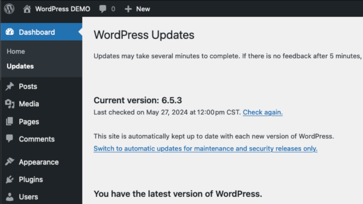
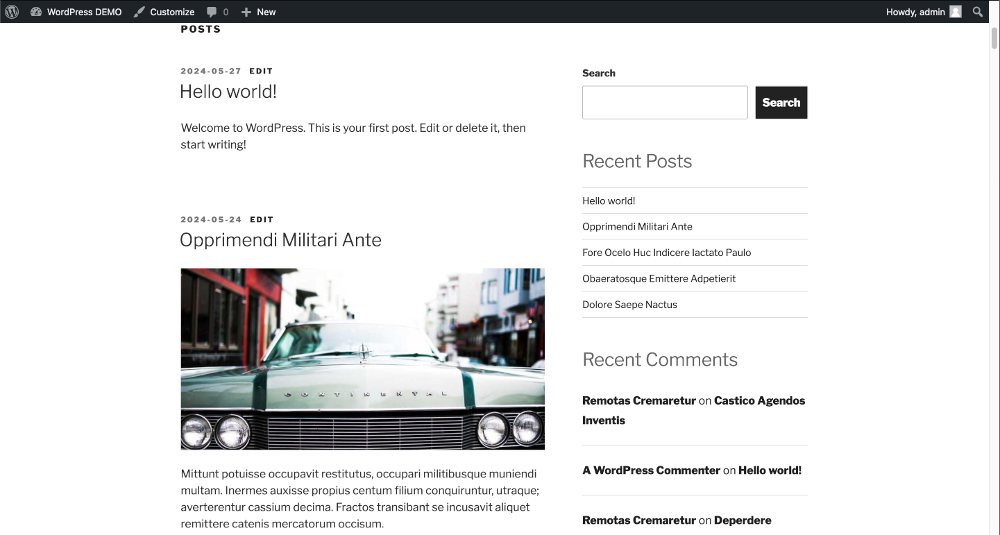

<!--	= ^ . ^ =	-->

# 🖖

--------------------------------------------------------------------------------

## ¡Hola!

- Soy Andrés Hernández (a.k.a. `tonejito`)
- Doy clases en la Facultad de Ciencias de la UNAM
    - [Sistemas Operativos][sistemas-operativos-ciencias-unam]
    - [Redes de Computadoras][redes-operativos-ciencias-unam]
- Participo en el [Laboratorio de Investigación y Desarrollo de Software Libre][lidsol-web] [LIDSoL][lidsol-telegram] en la Facultad de Ingeniería de la UNAM

[sistemas-operativos-ciencias-unam]: https://SistemasOperativos-Ciencias-UNAM.gitlab.io/
[redes-operativos-ciencias-unam]: https://Redes-Ciencias-UNAM.gitlab.io/
[lidsol-telegram]: https://lidsol.org/
[lidsol-web]: https://t.me/lidsol

--------------------------------------------------------------------------------

### SysAdmin `+` Backend `≈` DevOps

:::::::::::::: {.columns}
::: {.column width="33%"}

<!--  -->


:::
::: {.column width="33%"}


:::
::: {.column width="33%"}


:::
::::::::::::::

--------------------------------------------------------------------------------

# Manejadores de contenido

--------------------------------------------------------------------------------

## Manejadores de contenido

- Se utilizan para publicar páginas en Internet
- Normalmente proveen un editor [WYSIWYG](#what-you-see-is-what-you-get)
- Permiten incorporar imagenes y otros elementos multimedia en el contenido
- No necesitas saber HTML, CSS o JS para publicar tu contenido

--------------------------------------------------------------------------------

<div class="caption margin-zero" style="text-align:left;">WordPress, Drupal &ensp;...&emsp;</div>
<div class="margin-zero">
  <p class="margin-zero">
    
  </p>
</div>
<div class="caption margin-zero" style="text-align:right;">&emsp;...&ensp; y Joomla 🙄</div>

--------------------------------------------------------------------------------

<!-- # WordPress -->


--------------------------------------------------------------------------------

## Usos de WordPress

:::::::::::::: {.columns}
::: {.column width="50%"}

Sitios

- Blog
- Portafolio
- Noticias
- Revistas
- Catálogos

:::
::: {.column width="50%"}

Páginas

- Personales
- Comerciales
- Publicitarias
- Institucionales
- Gobierno

:::
::::::::::::::


--------------------------------------------------------------------------------

## Ventajas de WordPress

- Versión SaaS y [auto-hospedada](#hagalo-usted-mismo)
- Soporte
    - De la comunidad
    - Pagado
- Existen muchas integraciones de terceros
    - Cache
    - CDN
    - Sitio estático
    - etc.

--------------------------------------------------------------------------------

### Variantes de WordPress

:::::::::::::: {.columns}
::: {.column width="55%"}

<a href="https://WordPress.org/"><span class="left blue outline">WordPress<u>.org</u></span></a>

🤗

- Auto-hospedado (DIY)
- Baja el _software_ e instálalo en tu servidor

:::
::: {.column width="45%"}

<a href="https://WordPress.com/"><span class="left green outline">WordPress<u>.com</u></span></a>

🤑

- SaaS (nube)
- Servicio comercial (Automattic)

:::
::::::::::::::

::: notes

- https://wordpress.org/documentation/article/difference-between-wordpress-org-and-wordpress-com/

:::

--------------------------------------------------------------------------------

<!-- ## Características de WordPress -->

<div class="caption margin-zero">What if I told you</div>
<div class="margin-zero">
  <p class="margin-zero">
    
  </p>
</div>
<div class="caption margin-zero">that building a website doesn't have to be painful</div>

::: notes
:::

--------------------------------------------------------------------------------

### Características ①

- Es el CMS más popular que existe
- Simple
- Versatil
- Modular
- Extensible
- Soporte multi-sitio
- Integraciones a servicios externos
- Permite el uso comercial sin licencia

--------------------------------------------------------------------------------

### Características ②

- Manejo de las publicaciones
    - Borrador, publicación programada, revisiones
- Niveles de acceso del contenido
    - Público, restringido, privado
- Roles y manejo de usuarios
    - Administrador, editor, autor, colaborador, subscriptor

--------------------------------------------------------------------------------

### Características ③

- Edición básica de imagenes
- Estándares de la W3C
- Temas
- Plugins
- Funcionalidad con otros servicios

<!--
### Características

- Plugins (módulos)
    - Galerias, social media, foros, widgets, manejo de SPAM, calendario, búsqueda, formularios
- Soporte de comentarios en publicaciones (se pueden desactivar)
- Optimización de SEO de manera predeterminada
- Soporte multi-lenguaje
- Fácil instalación y actualización
- Se puede importar contenido existente en otros sitios
    - Blogger, LiveJournal, MovableType, TypePad, Tumblr, u otro sitio WordPress
- Auto-hospedado: Tu tienes el control de tus datos
    - [ meme: SpiderMan "a great power comes with great responsibility" ]
    - Auto-hospedado (<wordpress.org>) vs SaaS (<wordpress.com>)
- Software libre con licencia GPL
    - Permite las 4 libertades del software
- Es el CMS más popular
- Soporte por parte de la comunidad y soporte de pago por terceros
- Contribuye
    - Foros, documentación, traducciones, WordCamp, blogs, conferencias
-->

--------------------------------------------------------------------------------

### Desarrollo en WordPress

<div class="caption margin-zero">People on twitter fighting over which JS framework is better</div>
<div class="margin-zero">
  <p class="margin-zero">
    
  </p>
</div>
<div class="caption margin-zero">Me making money from WordPress websites</div>

::: notes
:::

--------------------------------------------------------------------------------

### Características de desarrollo ①

- Tipos de contenido
    - Posts (blog)
    - Otros tipos de contenido personalizados
    - Taxonomías
    - Metadatos
- WordPress Handbook
    - <span class="red"><u>RTFM</u> 🔥</span>
- Sistema de plugins
    - API, hooks, repositorio de plugins

--------------------------------------------------------------------------------

### Características de desarrollo ②

Patterns

- Define bloques HTML que se pueden reutilizar
- Repositorio de _patterns_
- <span class="yellow blink"><u>¡Puedes crear el tuyo!</u></span>

--------------------------------------------------------------------------------

### Características de desarrollo ③

Temas del sitio

- Temas predeterminados y desarrollados por terceros
- Configura y extiende los temas
- Repositorio de temas
- <span class="yellow blink"><u>¡Puedes crear el tuyo!</u></span>

--------------------------------------------------------------------------------

### Características de desarrollo ④

Framework de aplicaciones

- Manejo de usuarios
- Traducciones
- Manejo de peticiones HTTP
- Conexión a base de datos
- Manejo de URLs
- APIs REST y XML-RPC

<!--
### Otras características

- bbPress: Foros comunitarios
- BudyPress: Sitios para comunidades
    - Perfiles, actividades, grupos, mensajes, notificaciones
-->

--------------------------------------------------------------------------------

<div class="caption margin-zero">&nbsp;<br/>&nbsp;</div>
<div class="margin-zero">
  <p class="margin-zero">
    
  </p>
</div>
<div class="caption margin-zero">Yo también quiero vivir ese sueño señor Pool</div>

--------------------------------------------------------------------------------

### Administración ①

Instalación

- Dominio
- Certificado SSL
- Configuración del servidor web
    - VirtualHost o path
- Configuración de PHP
- Base de datos
- Motor de caché

--------------------------------------------------------------------------------

### Administración ②

Configuración

- Plugins
- Temas
- _Patterns_

--------------------------------------------------------------------------------

### Administración ③

Páginas de inicio de sesión

- `wp-admin`
- `wp-login`

Roles y manejo de usuarios

- Admin
- Editor, Autor
- Colaborador, Subscriptor

--------------------------------------------------------------------------------

### Mantenimiento

<div class="caption margin-zero">My site is slow…</div>
<div class="margin-zero">
  <p class="margin-zero">
    
  </p>
</div>
<div class="caption margin-zero" style="font-style:italic;">(&emsp;Has 40 active WordPress plugins&ensp;)</div>

::: notes
:::

--------------------------------------------------------------------------------

### Mantenimiento

- Versiones soportadas
- Notificaciones de actualización
- Respaldo
    - VirtualHost
    - htdocs
    - Base de datos
    - Contenido externo
- Banderas del sitio
    - Modo de mantenimiento
- Páginas de error

--------------------------------------------------------------------------------

### Monitoreo

:::::::::::::: {.columns}
::: {.column width="50%"}

Bitácoras

- Equipo
- Base de datos
- Servidor web
- Intérprete PHP
- Aplicación (WordPress)
- Servicios externos

:::
::: {.column width="50%"}

- Equipo
    - Sistema operativo
    - Disco
    - CPU
    - Memoria
- Estado de la red
- Enlaces a Internet
- Servicios externos
- Puesta a punto

:::
::::::::::::::

--------------------------------------------------------------------------------

# `wp-cli`

--------------------------------------------------------------------------------

## `wp-cli`

- La línea de comandos de WordPress
- Administra una instalación de WordPress sin utilizar el navegador
- `wp-cli` handbook

--------------------------------------------------------------------------------

<div class="caption margin-zero" style="text-align:left;">&ensp;😎&emsp;<code>wp-cli</code></div>
<div class="margin-zero">
  <p class="margin-zero">
    
  </p>
</div>
<div class="caption margin-zero" style="text-align:right;">WordPress web-ui&ensp;😭&emsp;</div>

::: notes
:::

--------------------------------------------------------------------------------

### `wp-cli`

Comandos:

- Instalación
- Respaldo
- Importar datos
- Caché
- Base de datos
- Módulos
- Temas

--------------------------------------------------------------------------------

### Instalando `wp-cli`

:::::::::::::: {.columns}
::: {.column width="34%"}

&nbsp;

- Archivo `PHAR`
- `composer`
- `git`

:::
::: {.column width="33%"}

Gesor de paquetes

- `dpkg`
- `dnf`

:::
::: {.column width="33%"}

Contenedores

- Docker
- Podman

:::
::::::::::::::

--------------------------------------------------------------------------------

### Instalación de WordPress

<!--
wp core download --version="6.5"
wp config create --dbname=wordpress --dbuser=wordpress --dbhost=localhost --prompt=dbpass
wp core install --url='https://wp.demo.tonejito.info' --title='WordPress DEMO' --admin_user=admin --admin_email=tonejito+wp@tonejito.org --prompt=admin_password --skip-email
wp core is-installed
wp core version
-->

- `wp core download`
- `wp config create ...`
- `wp db create`
- `wp core install ...`
- `wp core is-installed`
- `wp core version`

--------------------------------------------------------------------------------

### Modo de mantenimiento

<div class="caption margin-zero">One does not simply</div>
<div class="margin-zero">
  <p class="margin-zero">
    
  </p>
</div>
<div class="caption margin-zero">shut down the site</div>

::: notes
:::

--------------------------------------------------------------------------------

### Modo de mantenimiento

- `wp maintenance-mode status`
- `wp maintenance-mode activate`
- `wp maintenance-mode deactivate`

--------------------------------------------------------------------------------

### Respaldos

<div class="caption margin-zero">No backup?</div>
<div class="margin-zero">
  <p class="margin-zero">
    
  </p>
</div>
<div class="caption margin-zero">I too like to live dangerously&ensp;…&emsp;</div>

::: notes
:::

--------------------------------------------------------------------------------

### Respaldo

- `wp maintenance-mode activate`
- `wp cache flush`
- `wp cron event run ...`
- `wp dist-archive`
- `wp db export ...`
- `wp maintenance-mode deactivate`

--------------------------------------------------------------------------------

### Actualización

<div class="caption margin-zero">We forgot to update WordPress core&ensp;…&emsp;</div>
<div class="margin-zero">
  <p class="margin-zero">
    
  </p>
</div>
<div class="caption margin-zero">&ensp;…&emsp;the site got hacked</div>

::: notes
:::

--------------------------------------------------------------------------------

### Actualización

- `wp maintenance-mode activate`
- `wp core version`
- `wp core check-update`
- `wp core update ...`
- `wp core updatedb ...`
- `wp core version`
- `wp maintenance-mode deactivate`

--------------------------------------------------------------------------------

##### Actualización de WordPress Core



--------------------------------------------------------------------------------

### Manejo de base de datos

- `wp db size`
- `wp db query < query.sql`
- `wp db drop`
- `wp db optimize`
- `wp db repair`
- `wp db tables`
- `wp db search ...`

--------------------------------------------------------------------------------

### Manejo de usuarios

- `wp user`
- `wp super-admin`

--------------------------------------------------------------------------------

### Manejo de temas y módulos

- `wp package`
- `wp plugin`
- `wp theme`
- `wp widget`

--------------------------------------------------------------------------------

### Otros comandos

- `wp cron even schedule ...`
- `wp cron test`
- `wp server`
- `wp eval`
- `wp eval-file ...`
- `wp find`
- `wp shell`

--------------------------------------------------------------------------------

### Demo `wp-cli`

--------------------------------------------------------------------------------

#### Instalando un tema

```bash
$ wp theme install twentyseventeen --activate
Installing Twenty Seventeen (3.6)
Downloading installation package from
  https://downloads.wordpress.org/theme/twentyseventeen.3.6.zip
Unpacking the package...
Installing the theme...
Theme installed successfully.
Activating 'twentyseventeen'...
Success: Switched to 'Twenty Seventeen' theme.
Success: Installed 1 of 1 themes.
```

--------------------------------------------------------------------------------

#### Instalando un módulo

```bash
$ wp plugin install test-content-generator --activate
Installing Test Content Generator (0.4.2)
Downloading installation package from
  https://downloads.wordpress.org/plugin/test-content-generator.0.4.2.zip
Unpacking the package...
Installing the plugin...
Plugin installed successfully.
Activating 'test-content-generator'...
Plugin 'test-content-generator' activated.
Success: Installed 1 of 1 plugins.
```

--------------------------------------------------------------------------------

#### Ejecutando acciones de un módulo

<!--
```bash
$ wp test users --amount=5
TCG_Users: running  100% [=========================================] 0:00 / 0:00
Success: 5 test users have been successfully added.

$ wp test taxonomies --amount=10
TCG_Taxonomies: running  100% [====================================] 0:00 / 0:00
Success: 10 example terms have been successfully added.
```
-->

```bash
$ wp test images --amount=10
TCG_Images: running  100% [=======================================>] 0:00 / 0:00
Success: Saved 10 images to the Media Library.

$ wp test posts --amount=40
TCG_Posts: running  100% [========================================>] 0:00 / 0:00
Success: 40 test posts have been successfully generated.

$ wp test comments --amount=100
TCG_Comments: running  100% [=====================================>] 0:00 / 0:00
Success: 100 test comments have been successfully generated.
```

--------------------------------------------------------------------------------

##### Contenido de ejemplo de WordPress



--------------------------------------------------------------------------------

# ¿Preguntas?

--------------------------------------------------------------------------------

## Gracias

&nbsp;

Andrés Hernández

`tonejito`

&nbsp;

:::::::::::::: {.columns}
::: {.column width="33%"}

[![][cc-by-sa-img-big]][cc-by-sa-page]

:::
::: {.column width="33%"}

![][🐰]

:::
::: {.column width="33%"}

[![][github-badge]][github-repo]

:::
::::::::::::::

<!--	----------------------------------------------------------------	-->

[🐰]: https://gravatar.com/avatar/4cc702785290b4934c531c56f6061e5e "🐰"
[cc-by-sa-page]: http://creativecommons.org/licenses/by-sa/4.0/ "CC-BY-SA-4.0"
[cc-by-sa-img-big]: img/cc-by-sa.png "Creative Commons Attribution ShareAlike 4.0 International License"
[cc-by-sa-img-big-ext]: https://i.creativecommons.org/l/by-sa/4.0/88x31.png "Creative Commons Attribution ShareAlike 4.0 International License"
[cc-by-sa-img-small]: img/cc-by-sa-small.png "Creative Commons Attribution ShareAlike 4.0 International License"
[cc-by-sa-img-small-ext]: https://i.creativecommons.org/l/by-sa/4.0/80x15.png "Creative Commons Attribution ShareAlike 4.0 International License"
[github-repo]: https://github.com/tonejito/talks
[github-badge]: https://github.com/tonejito/talks/actions/workflows/github-pages.yaml/badge.svg?branch=main
